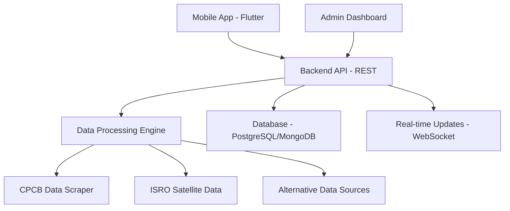

# 🌬️ Vayu Drishti - Real-Time Air Quality Visualizer App

**🏷️ Tagline: "Swasth Jeevan ki Shrishti!" (Creating Healthy Lives)**  
**🛰️ Subtitle: ISRO Satellite Air Quality Monitor**

[](https://flutter.dev)
[](https://python.org)
[](LICENSE)
[](https://github.com/Gurjas2112/Vayu_Drishti-Real-Time-Air-Quality-Visualizer-App)

## 📖 Project Overview

**Vayu Drishti** is a comprehensive real-time air quality monitoring and visualization system that combines **satellite data from ISRO**, **ground-based monitoring from CPCB**, and **modern mobile technology** to provide accurate, actionable air quality information to users across India.

The project consists of three main components:
- 📱 **Mobile App (Flutter)** - User-friendly interface for real-time monitoring
- 🕷️ **Data Scraping Engine (Python)** - Automated collection from multiple sources
- 📊 **Backend Services** - Data processing and API services *(planned)*

## 🎯 Key Features

### 📱 **Mobile Application**
- **Real-time AQI Dashboard** with color-coded health indicators
- **Interactive Satellite Maps** with heatmap overlays
- **24-hour Forecasting** with beautiful charts and analytics
- **Health Advisory System** with personalized recommendations
- **Location-based Monitoring** with GPS integration
- **Multiple Pollutant Tracking** (PM2.5, PM10, CO, NO2, O3, SO2, NH3, Pb)

### 🕷️ **Data Collection Engine**
- **CPCB Government Data** scraping with real-time updates
- **ISRO Satellite Data** integration from VEDAS/MOSDAC
- **Multiple Fallback Sources** for reliable data availability
- **Automated Data Validation** and quality assurance
- **CSV/JSON Export** capabilities for further analysis

### 🏗️ **System Architecture**
- **Microservices Design** for scalability
- **RESTful API** architecture *(planned)*
- **Real-time Data Processing** pipeline
- **Cloud-ready Deployment** configuration

## 🚀 Current Status

| Component | Status | Completion |
|-----------|--------|------------|
| 📱 Flutter Mobile App | ✅ **Working Prototype** | 100% |
| 🕷️ Data Scraping Engine | ✅ **Fully Functional** | 100% |
| 🗄️ Backend API Services | 🔄 **Planned** | 0% |
| ☁️ Cloud Deployment | 🔄 **Planned** | 0% |

## 📂 Project Structure

```
Vayu_Drishti-Real-Time-Air-Quality-Visualizer-App/
├── 📱 frontend_code/                    # Flutter Mobile Application
│   ├── lib/
│   │   ├── core/                       # App constants, routes, utilities
│   │   ├── providers/                  # State management (Provider pattern)
│   │   ├── screens/                    # All app screens (Auth, Home, Map, etc.)
│   │   └── widgets/                    # Reusable UI components
│   ├── assets/                         # Images, icons, animations
│   ├── pubspec.yaml                    # Flutter dependencies
│   └── README.md                       # Frontend documentation
│
├── 🕷️ aqi_web_scraper/                 # Python Data Collection Engine
│   ├── cpcb_aqi_scraper.py            # Main CPCB scraper
│   ├── advanced_cpcb_scraper.py       # Enhanced scraper with fallbacks
│   ├── isro_vedas_mosdac_scraper.py   # ISRO satellite data scraper
│   ├── check_isro_sources.py          # ISRO data source validator
│   ├── isro_data_explorer.py          # ISRO data analysis tool
│   ├── requirements.txt               # Python dependencies
│   ├── PROJECT_SUMMARY.md             # Detailed scraper documentation
│   └── DEPLOYMENT_GUIDE.md            # Setup and deployment guide
│
├── 🗄️ backend/                         # Backend Services (Empty - Planned)
├── 📄 research_paper_docs/             # Project Documentation & Research
├── 📜 LICENSE                          # MIT License
└── 📋 README.md                        # This file
```

## 🛠️ Installation & Setup

### Prerequisites
- **Flutter SDK** (≥3.9.2)
- **Python** (≥3.7)
- **Git**
- **Chrome Browser** (for web testing)

### 🚀 Quick Start

#### 1. Clone the Repository
```bash
git clone https://github.com/Gurjas2112/Vayu_Drishti-Real-Time-Air-Quality-Visualizer-App.git
cd Vayu_Drishti-Real-Time-Air-Quality-Visualizer-App
```

#### 2. Setup Mobile App (Flutter)
```bash
cd frontend_code
flutter pub get
flutter run -d chrome  # For web testing
# OR
flutter run  # For connected mobile device
```

**Test Credentials:** Any email/password (Mock authentication)
- Email: `test@example.com`
- Password: `123456`

#### 3. Setup Data Scraper (Python)
```bash
cd aqi_web_scraper
pip install -r requirements.txt
python cpcb_aqi_scraper.py  # Test CPCB scraper
python isro_vedas_mosdac_scraper.py  # Test ISRO scraper
```

## 📱 Mobile App Features

### 🎨 **Modern UI/UX Design**
- **Material Design 3** with purple-to-indigo gradient theme
- **Responsive Layout** for all screen sizes
- **Smooth Animations** and micro-interactions
- **Accessibility Features** compliant design

### 🏠 **Home Dashboard**
- Real-time AQI display with color-coded indicators
- Comprehensive pollutant monitoring (8 parameters)
- Health advisory cards with personalized recommendations
- Pull-to-refresh functionality

### 🗺️ **Interactive Maps**
- Satellite view integration
- AQI heatmap overlays
- Location-based air quality data
- Multiple map types (Normal/Satellite/Terrain)

### 📈 **Forecasting & Analytics**
- 24-hour AQI predictions
- Interactive charts for all pollutants
- Multiple timeframe views (24H/72H/Weekly)
- Data visualization with FL Chart

### 👤 **User Profile & Settings**
- User authentication system
- Notification preferences
- App settings and customization
- Privacy and terms information

## 🕷️ Data Collection Engine

### 📊 **Data Sources**
- **CPCB (Central Pollution Control Board)** - Official government monitoring
- **ISRO VEDAS/MOSDAC** - Satellite-based air quality data
- **Alternative Sources** - Backup data providers for reliability

### 🔧 **Technical Features**
- **Intelligent Scraping** with multiple fallback strategies
- **Data Validation** and quality assurance
- **Rate Limiting** for responsible data collection
- **Error Handling** with comprehensive logging
- **Multiple Output Formats** (CSV, JSON, Excel)

### 📈 **Sample Data Output**
```csv
Station,State,Latitude,Longitude,Pollutant,Value,Timestamp
Delhi - Anand Vihar,Delhi,28.6469,77.3158,PM2.5,45.5,2025-09-08 12:00:00
Mumbai - Bandra,Maharashtra,19.0596,72.8295,PM10,78.2,2025-09-08 12:00:00
```

## 🧪 Testing & Quality Assurance

### 📱 **Mobile App Testing**
- **Unit Tests** for core functionality
- **Widget Tests** for UI components
- **Integration Tests** for complete user flows
- **Performance Testing** for smooth user experience

### 🕷️ **Data Scraper Testing**
- **Comprehensive Test Suite** with 9+ test cases
- **Network Connectivity Tests** for reliability
- **Data Validation Tests** for accuracy
- **Error Handling Tests** for robustness

## 🔮 Future Development Roadmap

### 🎯 **Phase 1 - Backend Development** *(Next)*
- [ ] RESTful API development
- [ ] Database design and implementation
- [ ] Real-time data processing pipeline
- [ ] Authentication and user management

### 🎯 **Phase 2 - Advanced Features**
- [ ] Push notifications for air quality alerts
- [ ] Machine learning for improved forecasting
- [ ] Social features (sharing, community reports)
- [ ] Offline mode with cached data

### 🎯 **Phase 3 - Production Deployment**
- [ ] Cloud infrastructure setup (AWS/Azure/GCP)
- [ ] CI/CD pipeline implementation
- [ ] Performance optimization
- [ ] Security enhancements

### 🎯 **Phase 4 - Advanced Analytics**
- [ ] Historical data analysis
- [ ] Custom alert thresholds
- [ ] Export and reporting features
- [ ] API for third-party integrations

## 🏗️ Architecture Overview



## 🤝 Contributing

We welcome contributions! Please follow these steps:

1. **Fork** the repository
2. **Create** a feature branch (`git checkout -b feature/AmazingFeature`)
3. **Commit** your changes (`git commit -m 'Add some AmazingFeature'`)
4. **Push** to the branch (`git push origin feature/AmazingFeature`)
5. **Open** a Pull Request

### 📋 **Contribution Guidelines**
- Follow existing code style and conventions
- Add tests for new features
- Update documentation as needed
- Ensure all tests pass before submitting

## 📊 Technical Specifications

### 📱 **Mobile App (Flutter)**
- **Framework:** Flutter 3.9.2+
- **Language:** Dart
- **State Management:** Provider Pattern
- **UI Framework:** Material Design 3
- **Charts:** FL Chart
- **Maps:** Google Maps Flutter
- **Storage:** Shared Preferences

### 🕷️ **Data Scraper (Python)**
- **Language:** Python 3.7+
- **HTTP Client:** Requests, aiohttp
- **HTML Parsing:** BeautifulSoup4
- **Data Processing:** Pandas, NumPy
- **Visualization:** Matplotlib, Plotly
- **Configuration:** ConfigParser

### 🗄️ **Backend (Planned)**
- **Framework:** Node.js/Express or Python/FastAPI
- **Database:** PostgreSQL or MongoDB
- **Caching:** Redis
- **Message Queue:** RabbitMQ or Apache Kafka
- **Monitoring:** Prometheus + Grafana

## 📄 License

This project is licensed under the MIT License - see the [LICENSE](LICENSE) file for details.

## 🙏 Acknowledgments

- **ISRO** for providing satellite-based air quality data
- **CPCB** for official air quality monitoring data
- **Flutter Team** for the amazing cross-platform framework
- **Open Source Community** for various libraries and tools used

## 📞 Contact & Support

- **GitHub:** [Gurjas2112](https://github.com/Gurjas2112)
- **Project Link:** [Vayu Drishti Repository](https://github.com/Gurjas2112/Vayu_Drishti-Real-Time-Air-Quality-Visualizer-App)

For bugs, feature requests, or questions, please create an issue on GitHub.

---

<div align="center">

### 🌟 **Star this repository if you found it helpful!** 🌟

**Made with ❤️ for a cleaner, healthier India**

</div>
