# 🌬️ Vayu Drishti - Real-Time Air Quality Visualizer App

**🏷️ Tagline: "Swasth Jeevan ki Shrishti!" (Creating Healthy Lives)**  
**🛰️ Subtitle: ISRO Satellite Air Quality Monitor**

[](https://flutter.dev)
[](https://python.org)
[](https://nodejs.org)
[](https://typescriptlang.org)
[](https://supabase.com)
[](LICENSE)
[](https://github.com/Gurjas2112/Vayu_Drishti-Real-Time-Air-Quality-Visualizer-App)

---

## 📋 Table of Contents

- [🎯 Project Overview](#-project-overview)
- [🏗️ System Architecture](#️-system-architecture)
- [🔄 Data Flow](#-data-flow)
- [📱 Frontend Application](#-frontend-application)
- [🕷️ Data Collection Engine](#️-data-collection-engine)
- [🗄️ Backend Services](#️-backend-services)
- [📊 Research Foundation](#-research-foundation)
- [🚀 Installation & Setup](#-installation--setup)
- [📈 Usage Examples](#-usage-examples)
- [🧪 Testing & Quality](#-testing--quality)
- [🔮 Future Roadmap](#-future-roadmap)
- [🤝 Contributing](#-contributing)
- [📄 License](#-license)

---

## 🎯 Project Overview

**Vayu Drishti** is a comprehensive, real-time air quality monitoring and visualization ecosystem that combines satellite data from ISRO, ground-based monitoring from CPCB, and modern mobile technology to provide accurate, actionable air quality information across India.

### 🌟 Key Highlights

- **Multi-Source Data Integration**: ISRO satellite data + CPCB ground monitoring + alternative sources
- **Real-Time Processing**: Live data ingestion, processing, and visualization
- **Mobile-First Design**: Flutter-based cross-platform mobile application
- **Scalable Architecture**: Microservices-based backend with Node.js + TypeScript
- **Advanced Analytics**: 24-hour forecasting with machine learning integration
- **Research-Backed**: Built on comprehensive air quality research and best practices

### 🎯 Target Users

- **General Public**: Real-time air quality monitoring for health decisions
- **Researchers**: Comprehensive data access for environmental studies
- **Government Agencies**: Monitoring and policy-making support
- **Health Organizations**: Air quality health impact assessments

---

## 🏗️ System Architecture

### 🔧 High-Level Architecture Diagram


### 🏛️ Architecture Components

#### 1. **Data Collection Layer** (Python)
- **Location**: `aqi_web_scraper/`
- **Technologies**: Python 3.7+, BeautifulSoup4, Requests, Pandas
- **Responsibilities**:
  - ISRO satellite data extraction
  - CPCB government data scraping
  - Data validation and cleaning
  - Fallback source management
  - CSV/JSON data export

#### 2. **Backend Services** (Node.js + TypeScript)
- **Location**: `backend/`
- **Technologies**: Node.js, TypeScript, Express, Supabase, Socket.IO
- **Responsibilities**:
  - RESTful API endpoints
  - Real-time data processing
  - User authentication
  - Data aggregation and analytics
  - Push notification management

#### 3. **Frontend Application** (Flutter)
- **Location**: `frontend_code/`
- **Technologies**: Flutter 3.9.2+, Dart, Provider, Material Design 3
- **Responsibilities**:
  - Cross-platform mobile interface
  - Real-time data visualization
  - Interactive maps and charts
  - User profile management
  - Offline data caching

#### 4. **Database & Storage** (Supabase)
- **Technology**: PostgreSQL with Supabase
- **Responsibilities**:
  - User data and preferences
  - Historical AQI data
  - Station metadata
  - Forecast cache
  - Analytics and logs

---

## 🔄 Data Flow

### 📊 Complete Data Flow Diagram

```mermaid
flowchart TD
    subgraph "Data Sources"
        A1[ISRO VEDAS Portal<br/>Satellite Data]
        A2[CPCB CCR Portal<br/>Ground Monitoring]
        A3[OpenWeatherMap<br/>Alternative Source]
    end
    
    subgraph "Data Collection Pipeline"
        B1[ISRO Web Scraper<br/>isro_vedas_mosdac_scraper.py]
        B2[CPCB Web Scraper<br/>cpcb_aqi_scraper.py]
        B3[Advanced Scraper<br/>advanced_cpcb_scraper.py]
        B4[Data Validator<br/>Quality Assurance]
        B5[CSV/JSON Export<br/>Structured Data]
    end
    
    subgraph "Backend Processing"
        C1[Data Ingestion API<br/>/api/ingest]
        C2[AQI Calculator<br/>Processing Service]
        C3[Forecast Engine<br/>ML Predictions]
        C4[Data Aggregator<br/>Statistics & Trends]
        C5[Real-time Broadcaster<br/>Socket.IO]
    end
    
    subgraph "Database Layer"
        D1[(Supabase PostgreSQL)]
        D2[Raw AQI Data]
        D3[Processed Metrics]
        D4[User Profiles]
        D5[Historical Trends]
    end
    
    subgraph "Mobile Application"
        E1[📱 Flutter App]
        E2[🏠 Dashboard Screen]
        E3[🗺️ Map Visualization]
        E4[📈 Forecast Charts]
        E5[👤 User Profile]
    end
    
    subgraph "User Experience"
        F1[📊 Real-time AQI Display]
        F2[🔔 Health Alerts]
        F3[📍 Location-based Data]
        F4[📈 24-hour Forecasts]
        F5[💾 Offline Access]
    end
    
    A1 --> B1
    A2 --> B2
    A3 --> B3
    B1 --> B4
    B2 --> B4
    B3 --> B4
    B4 --> B5
    B5 --> C1
    C1 --> C2
    C2 --> C3
    C3 --> C4
    C2 --> D2
    C3 --> D3
    C4 --> D5
    D1 --> D2
    D1 --> D3
    D1 --> D4
    D1 --> D5
    C4 --> C5
    C5 --> E1
    E1 --> E2
    E1 --> E3
    E1 --> E4
    E1 --> E5
    E2 --> F1
    E2 --> F2
    E3 --> F3
    E4 --> F4
    E1 --> F5
    
    classDef source fill:#e3f2fd
    classDef collection fill:#fff8e1
    classDef backend fill:#f1f8e9
    classDef database fill:#fce4ec
    classDef frontend fill:#e8f5e8
    classDef user fill:#f3e5f5
    
    class A1,A2,A3 source
    class B1,B2,B3,B4,B5 collection
    class C1,C2,C3,C4,C5 backend
    class D1,D2,D3,D4,D5 database
    class E1,E2,E3,E4,E5 frontend
    class F1,F2,F3,F4,F5 user
```



### 🔄 Data Processing Workflow

1. **Data Collection** (Every 15 minutes)
   - ISRO scraper collects satellite data
   - CPCB scraper gets ground station data
   - Fallback scrapers ensure data availability
   - Quality validation and cleaning

2. **Data Ingestion** (Real-time)
   - Backend API receives processed data
   - AQI calculations and standardization
   - Data normalization and validation
   - Database storage with timestamps

3. **Data Processing** (Continuous)
   - Trend analysis and pattern detection
   - 24-hour forecast generation
   - Health advisory calculations
   - Real-time alert triggering

4. **Data Distribution** (Real-time)
   - Socket.IO broadcasts to connected clients
   - Push notifications for critical alerts
   - API endpoints for historical data
   - Mobile app data synchronization

---

## 📱 Frontend Application

### 🎨 Application Architecture


### 🔧 Key Features Implementation

#### 🏠 Dashboard Screen
- **Real-time AQI Display**: Color-coded AQI values with health indicators
- **Pollutant Monitoring**: PM2.5, PM10, CO, NO2, O3, SO2, NH3, Pb tracking
- **Health Advisory**: Dynamic recommendations based on AQI levels
- **Pull-to-Refresh**: Manual data synchronization

#### 🗺️ Interactive Maps
- **Google Maps Integration**: Satellite and terrain view options
- **AQI Heatmap Overlay**: Visual representation of air quality distribution
- **Location Markers**: Station-specific AQI data points
- **Real-time Updates**: Live data synchronization

#### 📈 Forecast & Analytics
- **24-Hour Predictions**: ML-based AQI forecasting
- **Interactive Charts**: FL Chart library integration
- **Multiple Timeframes**: 24H, 72H, and weekly views
- **Pollutant Trends**: Individual pollutant tracking

#### 👤 User Management
- **Authentication**: Email/password with validation
- **Profile Settings**: Personalized preferences
- **Notification Controls**: Alert customization
- **Data Export**: Personal data download

### 📚 Technical Stack

```yaml
dependencies:
  flutter: sdk: flutter
  
  # State Management
  provider: ^6.1.2
  
  # UI & Design
  flutter_svg: ^2.0.10+1
  lottie: ^3.1.2
  shimmer: ^3.0.0
  
  # Maps & Location
  google_maps_flutter: ^2.9.0
  location: ^8.0.1
  geolocator: ^14.0.2
  
  # Charts & Visualization
  fl_chart: ^1.1.0
  
  # Networking
  http: ^1.2.2
  dio: ^5.7.0
  
  # Storage
  shared_preferences: ^2.3.2
  
  # Utilities
  intl: ^0.20.2
  logger: ^2.4.0
```

---

## 🕷️ Data Collection Engine

### 🐍 Python Scraping Architecture


### 📊 Data Sources & Collection Strategy

#### 🛰️ ISRO VEDAS/MOSDAC Integration
- **Source**: https://vedas.sac.gov.in/mosdac/
- **Data Type**: Satellite-based air quality measurements
- **Coverage**: Pan-India satellite imagery and data
- **Update Frequency**: Every 6 hours
- **Parameters**: PM2.5, PM10, AOD (Aerosol Optical Depth)

#### 🏭 CPCB Government Data
- **Source**: https://app.cpcbccr.com/ccr/
- **Data Type**: Ground-based monitoring stations
- **Coverage**: 200+ stations across India
- **Update Frequency**: Every 15 minutes
- **Parameters**: PM2.5, PM10, CO, NO2, O3, SO2, NH3, Pb

#### 🔄 Alternative Sources
- **OpenWeatherMap Air Pollution API**: Backup data source
- **IQAir API**: International air quality data
- **Local Weather Services**: Regional data providers

### 🛠️ Technical Implementation

#### Core Scraping Components

```python
# ISRO Data Scraper
class ISRODataScraper:
    def __init__(self):
        self.base_url = "https://vedas.sac.gov.in/mosdac/"
        self.session = requests.Session()
        
    def fetch_satellite_data(self, date_range):
        """Fetch satellite air quality data"""
        
    def process_geospatial_data(self, raw_data):
        """Process satellite imagery and data"""
        
    def export_to_csv(self, processed_data):
        """Export structured data"""

# CPCB Data Scraper  
class CPCBDataScraper:
    def __init__(self):
        self.api_endpoints = [
            "https://app.cpcbccr.com/ccr/#/caaqm-dashboard-all/caaqm-landing",
            # Fallback endpoints
        ]
        
    def scrape_station_data(self):
        """Scrape real-time station data"""
        
    def validate_data_quality(self, data):
        """Ensure data accuracy and completeness"""
        
    def calculate_aqi(self, pollutant_data):
        """Calculate standard AQI values"""
```

#### Quality Assurance Features

- **Data Validation**: Range checks, outlier detection
- **Error Handling**: Network timeouts, parsing errors
- **Rate Limiting**: Respectful scraping practices
- **Logging**: Comprehensive operation logs
- **Testing**: Unit tests for all components

### 📈 Sample Output Data

```csv
Station,State,Latitude,Longitude,Pollutant,Value,Timestamp,AQI_Category
Delhi - Anand Vihar,Delhi,28.6469,77.3158,PM2.5,45.5,2025-09-22 12:00:00,Moderate
Mumbai - Bandra,Maharashtra,19.0596,72.8295,PM10,78.2,2025-09-22 12:00:00,Poor
Bangalore - BTM Layout,Karnataka,12.9352,77.6245,NO2,32.1,2025-09-22 12:00:00,Good
Chennai - Manali,Tamil Nadu,13.1614,80.2581,SO2,18.7,2025-09-22 12:00:00,Good
Kolkata - Rabindra Bharati,West Bengal,22.6540,88.3700,CO,1.2,2025-09-22 12:00:00,Good
```

---

## 🗄️ Backend Services

### 🔧 Node.js + TypeScript API Architecture


### 🔧 Backend Technology Stack

```json
{
  "name": "vayu-drishti-backend",
  "version": "1.0.0",
  "dependencies": {
    "express": "^4.19.2",
    "typescript": "^5.6.2",
    "@supabase/supabase-js": "^2.48.1",
    "socket.io": "^4.7.5",
    "firebase-admin": "^12.6.0",
    "cors": "^2.8.5",
    "morgan": "^1.10.0",
    "dotenv": "^16.4.5"
  }
}
```

### 🛠️ API Endpoints

#### Core AQI Endpoints
```typescript
// GET /api/aqi/current
// Get current AQI data for all stations
interface AQIResponse {
  stations: {
    id: string;
    name: string;
    latitude: number;
    longitude: number;
    aqi: number;
    category: string;
    pollutants: PollutantData[];
    timestamp: Date;
  }[];
}

// GET /api/aqi/location/:lat/:lng
// Get AQI data for specific location
interface LocationAQIResponse {
  location: {
    latitude: number;
    longitude: number;
    address: string;
  };
  current: AQIData;
  nearby_stations: AQIData[];
  forecast: ForecastData[];
}

// GET /api/aqi/forecast/:stationId
// Get 24-hour forecast for specific station
interface ForecastResponse {
  station: StationInfo;
  forecast: {
    timestamp: Date;
    aqi: number;
    category: string;
    pollutants: PollutantData[];
    confidence: number;
  }[];
}
```

#### Data Ingestion Endpoints
```typescript
// POST /api/ingest/aqi
// Ingest new AQI data from scrapers
interface IngestRequest {
  source: 'isro' | 'cpcb' | 'alternative';
  data: RawAQIData[];
  timestamp: Date;
}

// POST /api/ingest/validate
// Validate and process raw data
interface ValidationResponse {
  valid_records: number;
  invalid_records: number;
  errors: ValidationError[];
  processed_data: ProcessedAQIData[];
}
```

### 🗃️ Database Schema (Supabase PostgreSQL)

```sql
-- Stations table
CREATE TABLE stations (
  id UUID PRIMARY KEY DEFAULT gen_random_uuid(),
  name VARCHAR(255) NOT NULL,
  state VARCHAR(100) NOT NULL,
  latitude DECIMAL(10, 8) NOT NULL,
  longitude DECIMAL(11, 8) NOT NULL,
  station_type VARCHAR(50) NOT NULL, -- 'government', 'satellite', 'community'
  is_active BOOLEAN DEFAULT true,
  created_at TIMESTAMP WITH TIME ZONE DEFAULT NOW(),
  updated_at TIMESTAMP WITH TIME ZONE DEFAULT NOW()
);

-- AQI readings table
CREATE TABLE aqi_readings (
  id UUID PRIMARY KEY DEFAULT gen_random_uuid(),
  station_id UUID REFERENCES stations(id),
  pm25 DECIMAL(8, 2),
  pm10 DECIMAL(8, 2),
  co DECIMAL(8, 2),
  no2 DECIMAL(8, 2),
  o3 DECIMAL(8, 2),
  so2 DECIMAL(8, 2),
  nh3 DECIMAL(8, 2),
  pb DECIMAL(8, 2),
  aqi INTEGER NOT NULL,
  aqi_category VARCHAR(50) NOT NULL,
  data_source VARCHAR(50) NOT NULL,
  timestamp TIMESTAMP WITH TIME ZONE NOT NULL,
  created_at TIMESTAMP WITH TIME ZONE DEFAULT NOW()
);

-- Users and profiles
CREATE TABLE profiles (
  id UUID REFERENCES auth.users ON DELETE CASCADE,
  username VARCHAR(50) UNIQUE,
  full_name TEXT,
  preferred_location_lat DECIMAL(10, 8),
  preferred_location_lng DECIMAL(11, 8),
  notification_preferences JSONB DEFAULT '{}',
  created_at TIMESTAMP WITH TIME ZONE DEFAULT NOW(),
  updated_at TIMESTAMP WITH TIME ZONE DEFAULT NOW(),
  PRIMARY KEY (id)
);

-- Forecasts table
CREATE TABLE forecasts (
  id UUID PRIMARY KEY DEFAULT gen_random_uuid(),
  station_id UUID REFERENCES stations(id),
  forecast_timestamp TIMESTAMP WITH TIME ZONE NOT NULL,
  predicted_aqi INTEGER NOT NULL,
  predicted_category VARCHAR(50) NOT NULL,
  confidence_score DECIMAL(5, 2),
  model_version VARCHAR(20),
  created_at TIMESTAMP WITH TIME ZONE DEFAULT NOW()
);
```

---

## 📊 Research Foundation

### 📚 Academic Research Base

The Vayu Drishti project is built on comprehensive academic research and industry best practices in air quality monitoring and mobile application development.

#### 📖 Research Documents

1. **Research Project Report** (`research_paper_essential_docs/Research_Project_Report.pdf`)
   - Comprehensive analysis of air quality monitoring challenges in India
   - Literature review of existing solutions and technologies
   - Proposed methodology and system design
   - Expected outcomes and societal impact

2. **Problem Statement Analysis** (`research_paper_essential_docs/Air_Quality_Visualizer_Problem_Statement.pdf`)
   - Detailed problem identification and scope definition
   - Stakeholder analysis and user requirements
   - Technical feasibility and implementation challenges
   - Success metrics and evaluation criteria

3. **Related Research Papers** (`research_paper_essential_docs/already_published_research_papers/`)
   - Air Quality Prediction using Machine Learning
   - Sensor-based Air Quality Monitoring Systems
   - Mobile Applications for Environmental Monitoring
   - Real-time Data Visualization Techniques

### 🎯 Research Objectives

1. **Real-time Data Integration**: Combine multiple data sources for comprehensive coverage
2. **User-Centric Design**: Mobile-first approach for maximum accessibility
3. **Scalable Architecture**: Design for nationwide deployment
4. **Health Impact Focus**: Translate air quality data into actionable health advice
5. **Technology Innovation**: Leverage latest mobile and web technologies

### 📈 Research Contributions

- **Multi-Source Data Fusion**: Novel approach to combining satellite and ground-based data
- **Mobile-First Visualization**: Optimized air quality presentation for mobile devices
- **Real-time Processing**: Efficient data pipeline for immediate availability
- **Health Advisory System**: Automated health recommendations based on AQI levels
- **Open Source Implementation**: Reusable components for similar projects

---

## 🚀 Installation & Setup

### 📋 Prerequisites

- **Flutter SDK**: Version 3.9.2 or higher
- **Python**: Version 3.7 or higher
- **Node.js**: Version 18 or higher
- **Git**: For version control
- **Chrome Browser**: For web testing
- **VS Code**: Recommended IDE with Flutter extension

### 🔧 Environment Setup

#### 1. **Clone Repository**

```bash
git clone https://github.com/Gurjas2112/Vayu_Drishti-Real-Time-Air-Quality-Visualizer-App.git
cd Vayu_Drishti-Real-Time-Air-Quality-Visualizer-App
```

#### 2. **Frontend Setup (Flutter)**

```bash
# Navigate to frontend directory
cd frontend_code

# Install Flutter dependencies
flutter pub get

# Run Flutter doctor to check setup
flutter doctor

# Run on Chrome (recommended for development)
flutter run -d chrome

# Alternative: Run on connected device
flutter run
```

**Test Credentials for Mock Authentication:**
- Email: `test@example.com` (or any valid email format)
- Password: `123456` (or any password ≥6 characters)

#### 3. **Data Scraper Setup (Python)**

```bash
# Navigate to scraper directory
cd aqi_web_scraper

# Create virtual environment (recommended)
python -m venv venv
source venv/bin/activate  # On Windows: venv\Scripts\activate

# Install Python dependencies
pip install -r requirements.txt

# Test CPCB scraper
python cpcb_aqi_scraper.py

# Test ISRO scraper
python isro_vedas_mosdac_scraper.py

# Run comprehensive tests
python test_scraper.py
```

#### 4. **Backend Setup (Node.js + TypeScript)**

```bash
# Navigate to backend directory
cd backend

# Install Node.js dependencies
npm install

# Copy environment template
cp .env.example .env

# Edit .env file with your configuration
# SUPABASE_URL=your_supabase_url
# SUPABASE_ANON_KEY=your_supabase_anon_key
# FIREBASE_PROJECT_ID=your_firebase_project_id

# Start development server
npm run dev

# Build for production
npm run build

# Start production server
npm start
```

### 🔑 Environment Configuration

#### Backend `.env` Configuration

```env
# Supabase Configuration
SUPABASE_URL=https://your-project.supabase.co
SUPABASE_ANON_KEY=your_supabase_anon_key
SUPABASE_SERVICE_KEY=your_supabase_service_key

# Firebase Configuration
FIREBASE_PROJECT_ID=your_firebase_project_id
FIREBASE_PRIVATE_KEY=your_firebase_private_key
FIREBASE_CLIENT_EMAIL=your_firebase_client_email

# Server Configuration
PORT=3000
NODE_ENV=development

# External APIs
OPENWEATHER_API_KEY=your_openweather_api_key
GOOGLE_MAPS_API_KEY=your_google_maps_api_key
```

#### Supabase Database Setup

```bash
# Run database migrations
npm run db:migrate

# Seed initial data
npm run db:seed

# Reset database (development only)
npm run db:reset
```

### 🧪 Verification Steps

#### Frontend Verification
1. Launch Flutter app in Chrome
2. Navigate through all screens (Auth → Home → Map → Forecast → Profile)
3. Test authentication with mock credentials
4. Verify data display and UI responsiveness

#### Backend Verification
1. Check API server running on `http://localhost:3000`
2. Test endpoints: `GET /api/health` should return `200 OK`
3. Verify database connection in server logs
4. Test real-time WebSocket connection

#### Data Scraper Verification
1. Run test suite: `python test_scraper.py`
2. Check output files in `aqi_web_scraper/` directory
3. Verify CSV/JSON data format
4. Test error handling with `python check_urls.py`

---

## 📈 Usage Examples

### 📱 Mobile App Usage

#### 🏠 Home Dashboard
1. **Launch App**: Animated splash screen with satellite theme
2. **Authentication**: Login with test credentials or sign up
3. **Dashboard View**: 
   - Current AQI display with color-coded status
   - Comprehensive pollutant monitoring (8 parameters)
   - Health advisory cards with recommendations
   - Pull-to-refresh for data updates

#### 🗺️ Interactive Maps
1. **Map Navigation**: Swipe to map tab in bottom navigation
2. **Location Services**: Allow location access for current position
3. **AQI Visualization**:
   - Toggle heatmap overlay for regional view
   - Tap markers for station-specific data
   - Switch between Normal/Satellite/Terrain views

#### 📈 Forecast & Analytics
1. **Forecast View**: Swipe to forecast tab
2. **Interactive Charts**: 
   - View 24-hour AQI predictions
   - Switch between timeframes (24H/72H/Weekly)
   - Tap charts for detailed data points
3. **Pollutant Trends**: Individual pollutant tracking over time

### 🐍 Data Scraper Usage

#### Basic Scraping Operations

```bash
# Quick data collection
python cpcb_aqi_scraper.py

# Advanced scraping with configuration
python advanced_cpcb_scraper.py

# ISRO satellite data collection
python isro_vedas_mosdac_scraper.py

# Alternative sources when primary is down
python alternative_aqi_scraper.py
```

#### Data Analysis and Reporting

```bash
# Generate analysis reports
python simple_analysis.py

# Create visualization charts
python isro_data_explorer.py

# Check data source availability
python check_urls.py

# Generate sample data for testing
python generate_sample_data.py
```

#### Scheduled Data Collection

```bash
# Windows batch script for automation
run_scraper.bat

# Linux/Mac cron job setup
# Add to crontab: */15 * * * * /path/to/python /path/to/cpcb_aqi_scraper.py
```

### 🗄️ Backend API Usage

#### RESTful API Examples

```bash
# Get current AQI data for all stations
curl -X GET "http://localhost:3000/api/aqi/current"

# Get AQI data for specific location (Delhi)
curl -X GET "http://localhost:3000/api/aqi/location/28.6139/77.2090"

# Get 24-hour forecast for specific station
curl -X GET "http://localhost:3000/api/aqi/forecast/station-123"

# Ingest new data from scrapers
curl -X POST "http://localhost:3000/api/ingest/aqi" \
  -H "Content-Type: application/json" \
  -d '{"source": "cpcb", "data": [...], "timestamp": "2025-09-22T12:00:00Z"}'
```

#### WebSocket Real-time Updates

```javascript
// Frontend WebSocket connection
import io from 'socket.io-client';

const socket = io('http://localhost:3000');

// Listen for real-time AQI updates
socket.on('aqi-update', (data) => {
  console.log('New AQI data:', data);
  updateUI(data);
});

// Listen for health alerts
socket.on('health-alert', (alert) => {
  console.log('Health alert:', alert);
  showNotification(alert);
});
```

### 📊 Sample Data Output

#### CSV Format (Station Data)
```csv
Station,State,Latitude,Longitude,Pollutant,Value,Timestamp,AQI_Category
Delhi - Anand Vihar,Delhi,28.6469,77.3158,PM2.5,45.5,2025-09-22 12:00:00,Moderate
Mumbai - Bandra,Maharashtra,19.0596,72.8295,PM10,78.2,2025-09-22 12:00:00,Poor
Bangalore - BTM Layout,Karnataka,12.9352,77.6245,NO2,32.1,2025-09-22 12:00:00,Good
Chennai - Manali,Tamil Nadu,13.1614,80.2581,SO2,18.7,2025-09-22 12:00:00,Good
```

#### JSON Format (API Response)
```json
{
  "status": "success",
  "timestamp": "2025-09-22T12:00:00Z",
  "stations": [
    {
      "id": "delhi-anand-vihar",
      "name": "Delhi - Anand Vihar",
      "state": "Delhi",
      "coordinates": {
        "latitude": 28.6469,
        "longitude": 77.3158
      },
      "aqi": {
        "value": 156,
        "category": "Moderate",
        "color": "#FFA500"
      },
      "pollutants": {
        "pm25": 45.5,
        "pm10": 78.2,
        "co": 1.2,
        "no2": 32.1,
        "o3": 68.9,
        "so2": 18.7
      },
      "health_advisory": "Sensitive groups should reduce outdoor activities",
      "last_updated": "2025-09-22T11:45:00Z"
    }
  ]
}
```

---

## 🧪 Testing & Quality Assurance

### 🔬 Comprehensive Testing Strategy

#### 📱 Frontend Testing (Flutter)

```bash
# Unit tests for business logic
flutter test test/unit/

# Widget tests for UI components
flutter test test/widget/

# Integration tests for complete flows
flutter test test/integration/

# Performance testing
flutter test --coverage
```

**Test Coverage Areas:**
- Authentication flow (login/signup/logout)
- Data provider state management
- AQI calculation accuracy
- UI component rendering
- Navigation and routing
- API integration mocking

#### 🐍 Data Scraper Testing (Python)

```bash
# Run comprehensive test suite
python test_scraper.py

# Specific test categories
python -m pytest tests/ -v

# Coverage report generation
python -m pytest tests/ --cov=scrapers --cov-report=html
```

**Test Categories:**
- Network connectivity and timeouts
- HTML parsing accuracy
- Data validation and cleaning
- Error handling and recovery
- Rate limiting compliance
- Output format verification

#### 🗄️ Backend Testing (Node.js)

```bash
# Unit tests for controllers and services
npm run test:unit

# Integration tests for API endpoints
npm run test:integration

# End-to-end tests
npm run test:e2e

# Load testing
npm run test:load
```

**Test Scenarios:**
- API endpoint functionality
- Database operations
- Real-time WebSocket communication
- Authentication and authorization
- Data validation and processing
- Error handling and logging

### 📊 Quality Metrics

#### Code Quality Standards
- **Linting**: ESLint for TypeScript, Dart analyzer for Flutter, flake8 for Python
- **Formatting**: Prettier for JS/TS, dart format for Flutter, black for Python
- **Type Safety**: Strict TypeScript configuration, null safety in Dart
- **Documentation**: JSDoc comments, Dart documentation, Python docstrings

#### Performance Standards
- **Mobile App**: < 100MB memory usage, < 3s initial load time
- **API Response**: < 500ms average response time
- **Data Processing**: < 30s for complete scraping cycle
- **Database Queries**: < 100ms for standard operations

#### Security Standards
- **Authentication**: JWT tokens with refresh mechanism
- **Data Validation**: Input sanitization and validation
- **API Security**: Rate limiting, CORS configuration
- **Data Privacy**: GDPR-compliant data handling

### 🔍 Continuous Integration

#### GitHub Actions Workflow

```yaml
name: CI/CD Pipeline

on:
  push:
    branches: [ main, develop ]
  pull_request:
    branches: [ main ]

jobs:
  frontend-test:
    runs-on: ubuntu-latest
    steps:
      - uses: actions/checkout@v3
      - uses: subosito/flutter-action@v2
      - run: flutter test
      - run: flutter analyze

  backend-test:
    runs-on: ubuntu-latest
    steps:
      - uses: actions/checkout@v3
      - uses: actions/setup-node@v3
      - run: npm ci
      - run: npm run test
      - run: npm run build

  scraper-test:
    runs-on: ubuntu-latest
    steps:
      - uses: actions/checkout@v3
      - uses: actions/setup-python@v4
      - run: pip install -r requirements.txt
      - run: python -m pytest tests/
```

---

## 🔮 Future Roadmap

### 🎯 Phase 1: Backend Integration (Q1 2025)

#### Core Backend Development
- [ ] **RESTful API Implementation**: Complete Node.js + TypeScript backend
- [ ] **Database Integration**: Supabase PostgreSQL with real-time subscriptions
- [ ] **Authentication System**: JWT-based user management
- [ ] **Data Processing Pipeline**: Real-time AQI calculations and aggregations
- [ ] **WebSocket Integration**: Real-time data broadcasting to mobile clients

#### Mobile-Backend Integration
- [ ] **API Client Integration**: Replace mock data with real API calls
- [ ] **Real-time Updates**: WebSocket connection for live data
- [ ] **User Authentication**: Backend-integrated login system
- [ ] **Data Synchronization**: Offline data caching and sync
- [ ] **Push Notifications**: FCM integration for health alerts

### 🎯 Phase 2: Advanced Features (Q2 2025)

#### Machine Learning Integration
- [ ] **AQI Forecasting Model**: 24-48 hour predictions using historical data
- [ ] **Anomaly Detection**: Identify unusual pollution spikes
- [ ] **Health Impact Prediction**: Personalized health recommendations
- [ ] **Data Pattern Analysis**: Trend identification and reporting

#### Enhanced User Experience
- [ ] **Personalized Dashboards**: Customizable AQI displays
- [ ] **Location-based Alerts**: Geo-fenced pollution notifications
- [ ] **Social Features**: Community reporting and data sharing
- [ ] **Data Export**: Personal data download and reporting
- [ ] **Accessibility Features**: Voice commands and screen reader support

### 🎯 Phase 3: Scale & Optimization (Q3 2025)

#### Infrastructure & Performance
- [ ] **Cloud Deployment**: AWS/Azure production deployment
- [ ] **CDN Integration**: Global content delivery network
- [ ] **Database Optimization**: Query performance and indexing
- [ ] **API Rate Limiting**: Comprehensive usage management
- [ ] **Monitoring & Analytics**: Application performance monitoring

#### Data Sources Expansion
- [ ] **International Data**: Global air quality integration
- [ ] **IoT Sensor Network**: Community sensor data integration
- [ ] **Weather Correlation**: Enhanced forecasting with weather data
- [ ] **Satellite Data Enhancement**: Higher resolution imagery
- [ ] **Alternative APIs**: Multiple backup data sources

### 🎯 Phase 4: Production & Distribution (Q4 2025)

#### Mobile App Store Release
- [ ] **App Store Submission**: iOS App Store optimization and submission
- [ ] **Google Play Release**: Android Play Store publishing
- [ ] **App Store Optimization**: Metadata, screenshots, descriptions
- [ ] **Beta Testing Program**: Closed beta with user feedback
- [ ] **Marketing Campaign**: User acquisition and awareness

#### Enterprise Features
- [ ] **API for Developers**: Public API with documentation
- [ ] **White-label Solutions**: Customizable versions for organizations
- [ ] **Data Analytics Dashboard**: Web-based admin interface
- [ ] **Bulk Data Downloads**: Historical data export capabilities
- [ ] **SLA and Support**: Enterprise-grade support options

### 🔬 Research & Innovation Roadmap

#### Academic Collaboration
- [ ] **Research Paper Publication**: Peer-reviewed research publication
- [ ] **Conference Presentations**: Technical conference participation
- [ ] **Open Source Community**: Developer community building
- [ ] **Educational Partnerships**: University collaboration programs

#### Technology Innovation
- [ ] **AR Visualization**: Augmented reality air quality overlays
- [ ] **AI-Powered Insights**: Advanced analytics and recommendations
- [ ] **Blockchain Integration**: Decentralized data verification
- [ ] **Edge Computing**: Local processing for faster responses

### 📈 Metrics & Success Criteria

#### User Adoption Targets
- **Year 1**: 10,000 active users
- **Year 2**: 100,000 active users
- **Year 3**: 1,000,000 active users

#### Technical Performance Targets
- **API Uptime**: 99.9% availability
- **Response Time**: < 200ms average
- **Data Accuracy**: > 95% compared to official sources
- **Mobile App Rating**: > 4.5 stars on app stores

#### Impact Metrics
- **Health Awareness**: Measured through user surveys
- **Data Accessibility**: Number of API calls and downloads
- **Research Contributions**: Academic citations and collaborations
- **Government Adoption**: Official partnerships and integrations

---

## 🤝 Contributing

We welcome contributions from developers, researchers, and air quality enthusiasts! Here's how you can contribute to Vayu Drishti:

### 🔧 Development Contributions

#### Code Contributions
1. **Fork the Repository**: Create your own fork of the project
2. **Create Feature Branch**: `git checkout -b feature/amazing-feature`
3. **Follow Coding Standards**: Maintain consistency with existing code
4. **Add Tests**: Include unit tests for new functionality
5. **Update Documentation**: Keep README and docs up to date
6. **Submit Pull Request**: Detailed description of changes

#### Areas for Contribution
- **Frontend Development**: Flutter UI/UX improvements
- **Backend Development**: Node.js API enhancements
- **Data Engineering**: Python scraper optimizations
- **DevOps**: CI/CD pipeline improvements
- **Testing**: Test coverage expansion
- **Documentation**: Technical writing and guides

### 📊 Data Contributions

#### Data Sources
- **New API Integrations**: Additional air quality data sources
- **Data Validation**: Accuracy verification and quality assurance
- **Historical Data**: Backfill missing or historical data
- **International Sources**: Global air quality data integration

#### Research Contributions
- **Algorithm Improvements**: Better AQI calculation methods
- **Forecasting Models**: Enhanced prediction algorithms
- **Data Analysis**: Statistical analysis and insights
- **Academic Research**: Peer-reviewed papers and studies

### 🎨 Design Contributions

#### UI/UX Design
- **Design System**: Component library and style guides
- **Accessibility**: WCAG compliance and inclusivity
- **User Research**: Usability testing and feedback
- **Visual Design**: Icons, illustrations, and branding

### 📚 Documentation Contributions

#### Technical Documentation
- **API Documentation**: Endpoint descriptions and examples
- **Installation Guides**: Platform-specific setup instructions
- **Architecture Docs**: System design and technical specifications
- **Code Comments**: Inline documentation improvements

#### User Documentation
- **User Guides**: How-to tutorials and FAQs
- **Video Tutorials**: Screen recordings and walkthroughs
- **Troubleshooting**: Common issues and solutions
- **Translations**: Multi-language support

### 🔍 Quality Assurance

#### Testing Contributions
- **Bug Reports**: Detailed issue descriptions with reproduction steps
- **Test Case Development**: Comprehensive test scenarios
- **Performance Testing**: Load testing and optimization
- **Security Testing**: Vulnerability assessment and fixes

#### Code Review
- **Pull Request Reviews**: Code quality and best practices
- **Architecture Reviews**: System design feedback
- **Security Reviews**: Security vulnerability assessments
- **Performance Reviews**: Optimization opportunities

### 📋 Contribution Guidelines

#### Code Standards
```bash
# Frontend (Flutter)
flutter analyze
dart format lib/

# Backend (Node.js)
npm run lint
npm run format

# Python (Data Scrapers)
flake8 scrapers/
black scrapers/
```

#### Commit Message Format
```
type(scope): description

[optional body]

[optional footer]
```

**Types**: feat, fix, docs, style, refactor, test, chore

#### Pull Request Process
1. **Update Documentation**: Include relevant documentation updates
2. **Add Tests**: Ensure new features have adequate test coverage
3. **Follow Code Style**: Maintain consistency with existing codebase
4. **Describe Changes**: Provide detailed PR description
5. **Link Issues**: Reference related GitHub issues

### 🏆 Recognition

#### Contributor Recognition
- **Contributors Page**: Public recognition for all contributors
- **Release Notes**: Acknowledgment in version releases
- **Social Media**: Recognition on project social channels
- **Conference Talks**: Opportunity to present contributions

#### Maintainer Opportunities
- **Active Contributors**: Invitation to join maintainer team
- **Specialized Roles**: Lead positions in specific areas
- **Decision Making**: Participation in project roadmap decisions
- **Mentorship**: Guide new contributors and reviewers

### 📞 Getting Help

#### Communication Channels
- **GitHub Issues**: Bug reports and feature requests
- **Discussions**: General questions and community chat
- **Email**: Direct contact for sensitive issues
- **Discord/Slack**: Real-time developer communication (planned)

#### Mentorship Program
- **New Contributor Guide**: Step-by-step onboarding process
- **Mentor Assignment**: Experienced developers for guidance
- **Pair Programming**: Collaborative development sessions
- **Code Review Training**: Learn best practices and standards

---

## 📄 License

### MIT License

```
MIT License

Copyright (c) 2025 Vayu Drishti - Real-Time Air Quality Visualizer

Permission is hereby granted, free of charge, to any person obtaining a copy
of this software and associated documentation files (the "Software"), to deal
in the Software without restriction, including without limitation the rights
to use, copy, modify, merge, publish, distribute, sublicense, and/or sell
copies of the Software, and to permit persons to whom the Software is
furnished to do so, subject to the following conditions:

The above copyright notice and this permission notice shall be included in all
copies or substantial portions of the Software.

THE SOFTWARE IS PROVIDED "AS IS", WITHOUT WARRANTY OF ANY KIND, EXPRESS OR
IMPLIED, INCLUDING BUT NOT LIMITED TO THE WARRANTIES OF MERCHANTABILITY,
FITNESS FOR A PARTICULAR PURPOSE AND NONINFRINGEMENT. IN NO EVENT SHALL THE
AUTHORS OR COPYRIGHT HOLDERS BE LIABLE FOR ANY CLAIM, DAMAGES OR OTHER
LIABILITY, WHETHER IN AN ACTION OF CONTRACT, TORT OR OTHERWISE, ARISING FROM,
OUT OF OR IN CONNECTION WITH THE SOFTWARE OR THE USE OR OTHER DEALINGS IN THE
SOFTWARE.
```

### 📋 Third-Party Licenses

#### Flutter Dependencies
- **Flutter SDK**: BSD 3-Clause License
- **Provider**: MIT License
- **FL Chart**: MIT License
- **Google Maps Flutter**: BSD 3-Clause License

#### Python Dependencies
- **Requests**: Apache Software License
- **BeautifulSoup4**: MIT License
- **Pandas**: BSD 3-Clause License
- **Matplotlib**: PSF License

#### Node.js Dependencies
- **Express.js**: MIT License
- **Socket.IO**: MIT License
- **Supabase**: MIT License
- **Firebase Admin**: Apache License 2.0

### 🛡️ Data Usage Policy

#### Data Sources Acknowledgment
- **ISRO VEDAS/MOSDAC**: Satellite data used under open data policy
- **CPCB**: Government air quality data accessed through public APIs
- **OpenWeatherMap**: Commercial API used under Terms of Service

#### User Data Privacy
- **Personal Information**: Collected only with explicit consent
- **Location Data**: Used only for relevant air quality information
- **Data Storage**: Secure storage with encryption at rest
- **Data Sharing**: No personal data shared with third parties without consent

### 🔒 Security Considerations

#### Responsible Disclosure
If you discover security vulnerabilities, please:
1. **Email Security Team**: security@vayudrishti.org
2. **Do Not Public Disclose**: Until fix is available
3. **Provide Details**: Clear reproduction steps
4. **Coordinate Fix**: Work with team on resolution

#### Security Measures
- **API Security**: Rate limiting and input validation
- **Data Encryption**: TLS for data in transit, AES for data at rest
- **Authentication**: JWT tokens with secure refresh mechanism
- **Database Security**: Parameterized queries and access controls

---

## 📞 Contact & Support

### 👨‍💻 Project Maintainers

#### Lead Developer
- **Name**: Gurjas Singh
- **GitHub**: [@Gurjas2112](https://github.com/Gurjas2112)
- **Email**: gurjas@vayudrishti.org
- **LinkedIn**: [Gurjas Singh](https://linkedin.com/in/gurjas2112)

#### Core Team
- **Frontend Lead**: Flutter and mobile development
- **Backend Lead**: Node.js and API development  
- **Data Engineering Lead**: Python scrapers and data processing
- **DevOps Lead**: Infrastructure and deployment

### 🌐 Project Links

#### Code Repositories
- **Main Repository**: [GitHub - Vayu Drishti](https://github.com/Gurjas2112/Vayu_Drishti-Real-Time-Air-Quality-Visualizer-App)
- **Documentation Site**: [docs.vayudrishti.org](https://docs.vayudrishti.org) (planned)
- **API Documentation**: [api.vayudrishti.org](https://api.vayudrishti.org) (planned)

#### Social Media & Community
- **Twitter**: [@VayuDrishti](https://twitter.com/vayudrishti) (planned)
- **LinkedIn**: [Vayu Drishti Project](https://linkedin.com/company/vayudrishti) (planned)
- **Discord Community**: [discord.gg/vayudrishti](https://discord.gg/vayudrishti) (planned)

### 📧 Support Channels

#### Technical Support
- **GitHub Issues**: Bug reports and feature requests
- **GitHub Discussions**: Community questions and help
- **Stack Overflow**: Tag questions with `vayu-drishti`
- **Email Support**: support@vayudrishti.org

#### Business Inquiries
- **Partnership**: partnerships@vayudrishti.org
- **Licensing**: licensing@vayudrishti.org
- **Media**: media@vayudrishti.org
- **General**: info@vayudrishti.org

### 🎯 Response Times

#### Support Response SLA
- **Critical Issues**: 24 hours
- **Bug Reports**: 48 hours
- **Feature Requests**: 72 hours
- **General Inquiries**: 5 business days

#### Community Support
- **GitHub Issues**: Monitored daily
- **Discussions**: Active community moderation
- **Pull Requests**: Reviewed within 3 business days
- **Documentation Updates**: Reviewed within 5 business days

### 🤝 Collaboration Opportunities

#### Academic Partnerships
- **Research Collaboration**: Joint research projects
- **Student Projects**: Internship and thesis opportunities
- **Data Access**: Academic research data sharing
- **Publication**: Collaborative paper opportunities

#### Industry Partnerships
- **Data Providers**: Additional air quality data sources
- **Technology Partners**: Platform and infrastructure partnerships
- **Government Agencies**: Policy and implementation collaboration
- **NGOs**: Environmental and health organizations

### 🎉 Acknowledgments

#### Special Thanks
- **ISRO**: For providing satellite-based air quality data
- **CPCB**: For official government monitoring data
- **Flutter Team**: For excellent cross-platform framework
- **Open Source Community**: For amazing libraries and tools
- **Beta Testers**: Early users who provided valuable feedback

#### Inspiration
This project is inspired by the need for accessible, real-time air quality information to help people make informed decisions about their health and daily activities. We believe that technology can play a crucial role in environmental awareness and public health.

---

<div align="center">

### 🌟 **Star this repository if you found it helpful!** 🌟

**Made with ❤️ for a cleaner, healthier India**

[](https://github.com/Gurjas2112/Vayu_Drishti-Real-Time-Air-Quality-Visualizer-App/stargazers)
[](https://github.com/Gurjas2112/Vayu_Drishti-Real-Time-Air-Quality-Visualizer-App/network/members)
[](https://github.com/Gurjas2112/Vayu_Drishti-Real-Time-Air-Quality-Visualizer-App/watchers)

---

**"Swasth Jeevan ki Shrishti!" - Creating Healthy Lives Through Technology**

</div>