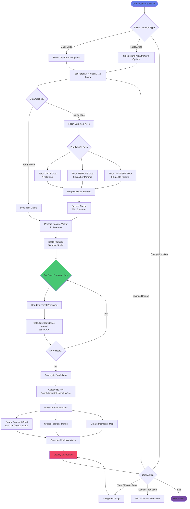
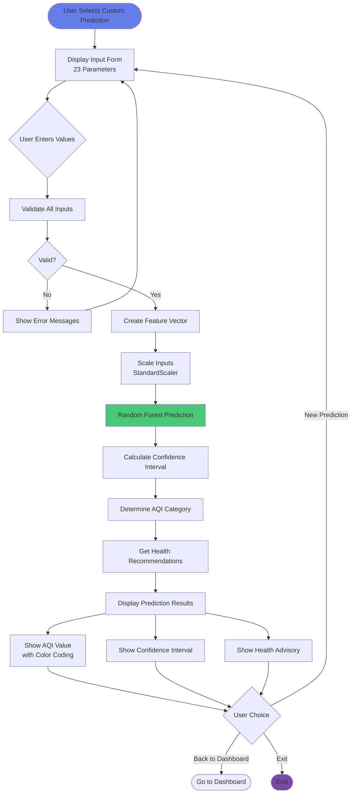
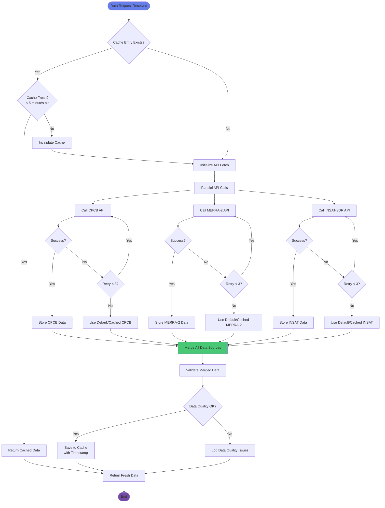
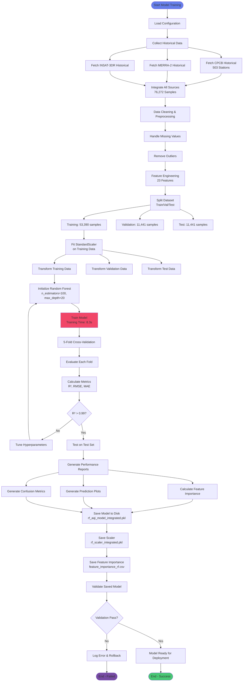
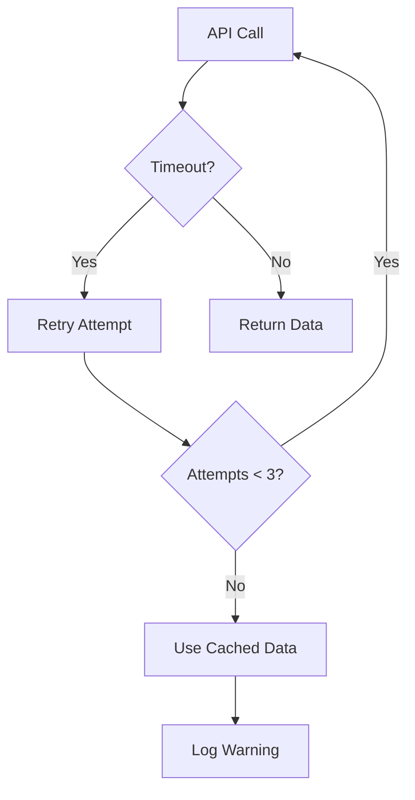
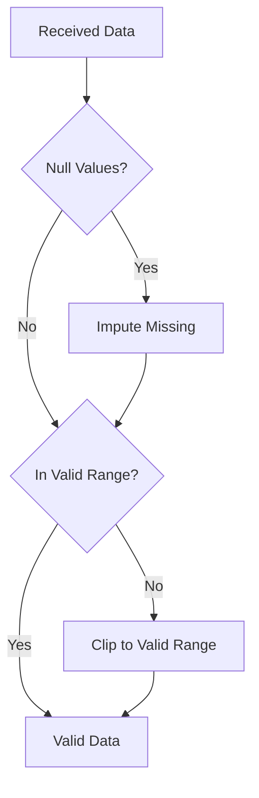

# Activity Diagram - Vayu Drishti Air Quality Visualizer

## Main User Flow - AQI Forecast Generation

### Mermaid Diagram



## Custom Prediction Flow



## Data Integration and Caching Activity



## Model Training Activity (Offline Process)



## PlantUML Code

```plantuml
@startuml
title Activity Diagram - AQI Forecast Generation

start
:User Opens Application;

:Select Location Type;
if (Major Cities?) then (yes)
  :Select City from 10 Options;
else (no)
  :Select Rural Area from 30 Options;
endif

:Set Forecast Horizon (1-72 hours);

:Check Data Cache;
if (Data Cached and Fresh?) then (yes)
  :Load from Cache;
else (no)
  fork
    :Fetch CPCB Data\n(7 Pollutants);
  fork again
    :Fetch MERRA-2 Data\n(8 Weather Parameters);
  fork again
    :Fetch INSAT-3DR Data\n(6 Satellite Parameters);
  end fork
  
  :Merge All Data Sources;
  :Save to Cache (TTL: 5 min);
endif

:Prepare Feature Vector\n(23 Features);
:Scale Features\n(StandardScaler);

repeat
  :Random Forest Prediction;
  :Calculate Confidence Interval\n(±4.57 AQI);
repeat while (More Forecast Hours?) is (yes)
->no;

:Aggregate Predictions;
:Categorize AQI\n(Good/Moderate/Unhealthy);

fork
  :Create Forecast Chart;
fork again
  :Create Pollutant Trends;
fork again
  :Create Interactive Map;
end fork

:Generate Health Advisory;
:Display Dashboard;

:User Action;
if (Change Settings?) then (yes)
  :Update Configuration;
  backward:Reload Data;
else if (Custom Prediction?) then (yes)
  :Go to Custom Prediction Flow;
else if (Exit?) then (yes)
  stop
else (continue)
  :Continue Viewing;
endif

@enduml
```

## Key Activity Descriptions

### 1. **Location Selection Activity**
- **Duration**: < 1 second
- **User Input**: Location type (City/Rural) and specific location
- **Output**: Selected location with coordinates
- **Validation**: Location must exist in database (40 options)

### 2. **Data Fetching Activity**
- **Duration**: 1-3 seconds (with cache), 3-8 seconds (without cache)
- **Parallel Execution**: Three API calls run simultaneously
- **Error Handling**: Retry mechanism (max 3 attempts per API)
- **Fallback**: Use cached data if APIs fail

### 3. **ML Prediction Activity**
- **Duration**: 50-100 ms per prediction
- **Input**: 23 features (CPCB + MERRA-2 + INSAT-3DR + Location)
- **Processing**: 
  1. Feature scaling
  2. Random Forest prediction
  3. Confidence calculation
- **Output**: AQI value with ±4.57 confidence interval

### 4. **Visualization Activity**
- **Duration**: 500 ms - 2 seconds
- **Components**:
  - Forecast chart with Plotly
  - Interactive map with Folium
  - Pollutant trend charts
- **Interactivity**: User can zoom, pan, hover for details

### 5. **Health Advisory Activity**
- **Duration**: < 100 ms
- **Input**: Predicted AQI value
- **Logic**:
  - 0-50: Good
  - 51-100: Moderate
  - 101-150: Unhealthy for Sensitive Groups
  - 151-200: Unhealthy
  - 201-300: Very Unhealthy
  - 300+: Hazardous
- **Output**: Health recommendations and activity suggestions

## Error Handling Activities

### API Failure Handling


### Data Quality Validation


## Performance Metrics

| Activity | Average Duration | Max Duration |
|----------|-----------------|--------------|
| Location Selection | 0.1s | 0.5s |
| Data Fetch (Cached) | 0.2s | 0.5s |
| Data Fetch (Fresh) | 2.5s | 8s |
| Feature Preparation | 0.05s | 0.1s |
| ML Prediction (1 hour) | 0.08s | 0.15s |
| ML Prediction (72 hours) | 3s | 6s |
| Visualization | 1s | 3s |
| Total (Cached) | 2s | 5s |
| Total (Fresh) | 5s | 15s |
