# Class Diagram - Vayu Drishti Air Quality Visualizer

## System Class Structure

### Mermaid Diagram

```mermaid
classDiagram
    class StreamlitApp {
        -config: Configuration
        -page: String
        -location: String
        -forecast_hours: int
        +run()
        +render_sidebar()
        +render_page()
        +handle_user_input()
    }
    
    class LocationManager {
        -major_cities: Dict
        -rural_areas: Dict
        -all_locations: Dict
        +get_location(name: String): Location
        +get_coordinates(name: String): Tuple
        +list_cities(): List
        +list_rural_areas(): List
        +validate_location(name: String): bool
    }
    
    class Location {
        -name: String
        -latitude: float
        -longitude: float
        -state: String
        -location_type: String
        +get_coordinates(): Tuple
        +get_name(): String
        +is_urban(): bool
        +is_rural(): bool
    }
    
    class ForecastEngine {
        -model: RandomForestModel
        -scaler: StandardScaler
        -feature_engine: FeatureEngine
        +generate_forecast(location: Location, hours: int): Forecast
        +predict_single(features: Array): float
        +calculate_confidence(prediction: float): Tuple
    }
    
    class RandomForestModel {
        -n_estimators: int
        -max_depth: int
        -r2_score: float
        -rmse: float
        -mae: float
        +load_model(path: String): void
        +predict(features: Array): float
        +get_feature_importance(): DataFrame
        +get_performance_metrics(): Dict
    }
    
    class StandardScaler {
        -mean: Array
        -std: Array
        +fit(data: Array): void
        +transform(data: Array): Array
        +inverse_transform(data: Array): Array
        +load(path: String): void
        +save(path: String): void
    }
    
    class FeatureEngine {
        -feature_names: List
        -feature_count: int
        +prepare_features(data: Dict): Array
        +validate_features(features: Array): bool
        +get_feature_names(): List
        +extract_from_sources(cpcb: CPCBData, merra2: MERRA2Data, insat: INSATData): Array
    }
    
    class DataPipeline {
        -cache_manager: CacheManager
        -api_clients: List
        +fetch_data(location: Location): IntegratedData
        +integrate_sources(): IntegratedData
        +validate_data(data: Dict): bool
    }
    
    class CacheManager {
        -cache_dir: String
        -ttl: int
        +get(key: String): Any
        +set(key: String, value: Any, ttl: int): void
        +exists(key: String): bool
        +is_fresh(key: String): bool
        +invalidate(key: String): void
        +clear_all(): void
    }
    
    class CPCBClient {
        -api_url: String
        -api_key: String
        +fetch_pollutants(location: Location): CPCBData
        +get_pm25(): float
        +get_pm10(): float
        +get_no2(): float
        +get_so2(): float
        +get_co(): float
        +get_o3(): float
        +get_nh3(): float
    }
    
    class MERRA2Client {
        -api_url: String
        -api_key: String
        +fetch_weather(location: Location): MERRA2Data
        +get_temperature(): float
        +get_humidity(): float
        +get_wind_speed(): float
        +get_wind_direction(): float
        +get_pressure(): float
        +get_precipitation(): float
        +get_boundary_layer_height(): float
        +get_surface_pressure(): float
    }
    
    class INSATClient {
        -api_url: String
        -api_key: String
        +fetch_satellite(location: Location): INSATData
        +get_aod550(): float
        +get_aerosol_index(): float
        +get_cloud_fraction(): float
        +get_surface_reflectance(): float
        +get_angstrom_exponent(): float
        +get_single_scattering_albedo(): float
    }
    
    class CPCBData {
        -timestamp: DateTime
        -pm25: float
        -pm10: float
        -no2: float
        -so2: float
        -co: float
        -o3: float
        -nh3: float
        +to_dict(): Dict
        +to_array(): Array
        +validate(): bool
    }
    
    class MERRA2Data {
        -timestamp: DateTime
        -temperature: float
        -humidity: float
        -wind_speed: float
        -wind_direction: float
        -pressure: float
        -precipitation: float
        -boundary_layer_height: float
        -surface_pressure: float
        +to_dict(): Dict
        +to_array(): Array
        +validate(): bool
    }
    
    class INSATData {
        -timestamp: DateTime
        -aod550: float
        -aerosol_index: float
        -cloud_fraction: float
        -surface_reflectance: float
        -angstrom_exponent: float
        -single_scattering_albedo: float
        +to_dict(): Dict
        +to_array(): Array
        +validate(): bool
    }
    
    class IntegratedData {
        -cpcb_data: CPCBData
        -merra2_data: MERRA2Data
        -insat_data: INSATData
        -location: Location
        -timestamp: DateTime
        +merge_all(): DataFrame
        +to_feature_vector(): Array
        +validate(): bool
    }
    
    class Forecast {
        -location: Location
        -predictions: List
        -confidence_intervals: List
        -timestamps: List
        -horizon: int
        +get_predictions(): List
        +get_peak_aqi(): Tuple
        +get_average_aqi(): float
        +get_confidence_band(): List
        +to_dataframe(): DataFrame
    }
    
    class HealthAdvisory {
        -aqi_value: float
        -category: String
        -color: String
        -emoji: String
        +categorize_aqi(aqi: float): String
        +get_recommendations(): List
        +get_color_code(): String
        +get_health_impact(): String
    }
    
    class VisualizationEngine {
        +create_forecast_chart(forecast: Forecast): Figure
        +create_map(location: Location, aqi: float): Map
        +create_pollutant_trends(data: IntegratedData): Figure
        +create_feature_importance(importance: DataFrame): Figure
    }
    
    class MapRenderer {
        -center: Tuple
        -zoom: int
        +render_location(location: Location, aqi: float): Map
        +add_marker(lat: float, lon: float, aqi: float): void
        +add_heatmap(data: List): void
        +set_color_by_aqi(aqi: float): String
    }
    
    class ChartGenerator {
        +create_line_chart(data: DataFrame): Figure
        +create_bar_chart(data: DataFrame): Figure
        +create_heatmap(data: DataFrame): Figure
        +add_confidence_bands(fig: Figure, confidence: List): Figure
        +add_aqi_categories(fig: Figure): Figure
    }
    
    class PredictionService {
        -model: RandomForestModel
        -scaler: StandardScaler
        +predict_custom(features: Dict): float
        +validate_inputs(features: Dict): bool
        +scale_features(features: Array): Array
        +generate_prediction_report(aqi: float): Dict
    }
    
    class ModelLoader {
        -model_dir: String
        +load_random_forest(path: String): RandomForestModel
        +load_scaler(path: String): StandardScaler
        +load_feature_importance(path: String): DataFrame
        +validate_model(model: Any): bool
    }
    
    class Configuration {
        -model_path: String
        -scaler_path: String
        -cache_dir: String
        -api_keys: Dict
        -ttl: int
        +load_config(path: String): void
        +get_value(key: String): Any
        +set_value(key: String, value: Any): void
    }
    
    %% Relationships
    StreamlitApp --> LocationManager
    StreamlitApp --> ForecastEngine
    StreamlitApp --> VisualizationEngine
    StreamlitApp --> HealthAdvisory
    StreamlitApp --> PredictionService
    StreamlitApp --> Configuration
    
    LocationManager --> Location
    
    ForecastEngine --> RandomForestModel
    ForecastEngine --> StandardScaler
    ForecastEngine --> FeatureEngine
    ForecastEngine --> Forecast
    ForecastEngine --> DataPipeline
    
    FeatureEngine --> IntegratedData
    
    DataPipeline --> CacheManager
    DataPipeline --> CPCBClient
    DataPipeline --> MERRA2Client
    DataPipeline --> INSATClient
    DataPipeline --> IntegratedData
    
    CPCBClient --> CPCBData
    MERRA2Client --> MERRA2Data
    INSATClient --> INSATData
    
    IntegratedData --> CPCBData
    IntegratedData --> MERRA2Data
    IntegratedData --> INSATData
    IntegratedData --> Location
    
    Forecast --> Location
    
    PredictionService --> RandomForestModel
    PredictionService --> StandardScaler
    
    ModelLoader --> RandomForestModel
    ModelLoader --> StandardScaler
    
    VisualizationEngine --> MapRenderer
    VisualizationEngine --> ChartGenerator
    
    HealthAdvisory ..> Forecast
```

## PlantUML Code

```plantuml
@startuml
title Class Diagram - Vayu Drishti Air Quality Visualizer

' Main Application
class StreamlitApp {
    -config: Configuration
    -page: String
    -location: String
    -forecast_hours: int
    --
    +run(): void
    +render_sidebar(): void
    +render_page(): void
    +handle_user_input(): void
}

' Location Management
class LocationManager {
    -major_cities: Dict<String, Location>
    -rural_areas: Dict<String, Location>
    -all_locations: Dict<String, Location>
    --
    +get_location(name: String): Location
    +get_coordinates(name: String): Tuple<float, float>
    +list_cities(): List<String>
    +list_rural_areas(): List<String>
    +validate_location(name: String): bool
}

class Location {
    -name: String
    -latitude: float
    -longitude: float
    -state: String
    -location_type: String
    --
    +get_coordinates(): Tuple<float, float>
    +get_name(): String
    +is_urban(): bool
    +is_rural(): bool
}

' Machine Learning
class ForecastEngine {
    -model: RandomForestModel
    -scaler: StandardScaler
    -feature_engine: FeatureEngine
    --
    +generate_forecast(location: Location, hours: int): Forecast
    +predict_single(features: Array): float
    +calculate_confidence(prediction: float): Tuple<float, float>
}

class RandomForestModel {
    -n_estimators: int = 100
    -max_depth: int = 20
    -r2_score: float = 0.9994
    -rmse: float = 4.57
    -mae: float = 2.33
    --
    +load_model(path: String): void
    +predict(features: Array): float
    +get_feature_importance(): DataFrame
    +get_performance_metrics(): Dict
}

class StandardScaler {
    -mean: Array
    -std: Array
    --
    +fit(data: Array): void
    +transform(data: Array): Array
    +inverse_transform(data: Array): Array
    +load(path: String): void
    +save(path: String): void
}

class FeatureEngine {
    -feature_names: List<String>
    -feature_count: int = 23
    --
    +prepare_features(data: Dict): Array
    +validate_features(features: Array): bool
    +get_feature_names(): List<String>
    +extract_from_sources(cpcb, merra2, insat): Array
}

' Data Management
class DataPipeline {
    -cache_manager: CacheManager
    -api_clients: List<APIClient>
    --
    +fetch_data(location: Location): IntegratedData
    +integrate_sources(): IntegratedData
    +validate_data(data: Dict): bool
}

class CacheManager {
    -cache_dir: String
    -ttl: int = 300
    --
    +get(key: String): Any
    +set(key: String, value: Any, ttl: int): void
    +exists(key: String): bool
    +is_fresh(key: String): bool
    +invalidate(key: String): void
    +clear_all(): void
}

' API Clients
class CPCBClient {
    -api_url: String
    -api_key: String
    --
    +fetch_pollutants(location: Location): CPCBData
    +get_pm25(): float
    +get_pm10(): float
    +get_no2(): float
    +get_so2(): float
    +get_co(): float
    +get_o3(): float
    +get_nh3(): float
}

class MERRA2Client {
    -api_url: String
    -api_key: String
    --
    +fetch_weather(location: Location): MERRA2Data
    +get_temperature(): float
    +get_humidity(): float
    +get_wind_speed(): float
    +get_pressure(): float
}

class INSATClient {
    -api_url: String
    -api_key: String
    --
    +fetch_satellite(location: Location): INSATData
    +get_aod550(): float
    +get_aerosol_index(): float
    +get_cloud_fraction(): float
}

' Data Models
class CPCBData {
    -timestamp: DateTime
    -pm25: float
    -pm10: float
    -no2: float
    -so2: float
    -co: float
    -o3: float
    -nh3: float
    --
    +to_dict(): Dict
    +to_array(): Array
    +validate(): bool
}

class MERRA2Data {
    -timestamp: DateTime
    -temperature: float
    -humidity: float
    -wind_speed: float
    -wind_direction: float
    -pressure: float
    -precipitation: float
    -boundary_layer_height: float
    -surface_pressure: float
    --
    +to_dict(): Dict
    +to_array(): Array
    +validate(): bool
}

class INSATData {
    -timestamp: DateTime
    -aod550: float
    -aerosol_index: float
    -cloud_fraction: float
    -surface_reflectance: float
    -angstrom_exponent: float
    -single_scattering_albedo: float
    --
    +to_dict(): Dict
    +to_array(): Array
    +validate(): bool
}

class IntegratedData {
    -cpcb_data: CPCBData
    -merra2_data: MERRA2Data
    -insat_data: INSATData
    -location: Location
    -timestamp: DateTime
    --
    +merge_all(): DataFrame
    +to_feature_vector(): Array
    +validate(): bool
}

' Forecast
class Forecast {
    -location: Location
    -predictions: List<float>
    -confidence_intervals: List<Tuple>
    -timestamps: List<DateTime>
    -horizon: int
    --
    +get_predictions(): List<float>
    +get_peak_aqi(): Tuple<float, DateTime>
    +get_average_aqi(): float
    +get_confidence_band(): List<Tuple>
    +to_dataframe(): DataFrame
}

' Health
class HealthAdvisory {
    -aqi_value: float
    -category: String
    -color: String
    -emoji: String
    --
    +categorize_aqi(aqi: float): String
    +get_recommendations(): List<String>
    +get_color_code(): String
    +get_health_impact(): String
}

' Visualization
class VisualizationEngine {
    +create_forecast_chart(forecast: Forecast): Figure
    +create_map(location: Location, aqi: float): Map
    +create_pollutant_trends(data: IntegratedData): Figure
    +create_feature_importance(importance: DataFrame): Figure
}

class MapRenderer {
    -center: Tuple<float, float>
    -zoom: int
    --
    +render_location(location: Location, aqi: float): Map
    +add_marker(lat: float, lon: float, aqi: float): void
    +add_heatmap(data: List): void
    +set_color_by_aqi(aqi: float): String
}

class ChartGenerator {
    +create_line_chart(data: DataFrame): Figure
    +create_bar_chart(data: DataFrame): Figure
    +create_heatmap(data: DataFrame): Figure
    +add_confidence_bands(fig: Figure, confidence: List): Figure
    +add_aqi_categories(fig: Figure): Figure
}

' Prediction Service
class PredictionService {
    -model: RandomForestModel
    -scaler: StandardScaler
    --
    +predict_custom(features: Dict): float
    +validate_inputs(features: Dict): bool
    +scale_features(features: Array): Array
    +generate_prediction_report(aqi: float): Dict
}

' Configuration
class Configuration {
    -model_path: String
    -scaler_path: String
    -cache_dir: String
    -api_keys: Dict
    -ttl: int
    --
    +load_config(path: String): void
    +get_value(key: String): Any
    +set_value(key: String, value: Any): void
}

' Relationships
StreamlitApp "1" --> "1" LocationManager
StreamlitApp "1" --> "1" ForecastEngine
StreamlitApp "1" --> "1" VisualizationEngine
StreamlitApp "1" --> "1" HealthAdvisory
StreamlitApp "1" --> "1" PredictionService
StreamlitApp "1" --> "1" Configuration

LocationManager "1" --> "*" Location

ForecastEngine "1" --> "1" RandomForestModel
ForecastEngine "1" --> "1" StandardScaler
ForecastEngine "1" --> "1" FeatureEngine
ForecastEngine "1" --> "*" Forecast
ForecastEngine "1" --> "1" DataPipeline

FeatureEngine --> IntegratedData

DataPipeline "1" --> "1" CacheManager
DataPipeline "1" --> "1" CPCBClient
DataPipeline "1" --> "1" MERRA2Client
DataPipeline "1" --> "1" INSATClient
DataPipeline --> IntegratedData

CPCBClient --> CPCBData
MERRA2Client --> MERRA2Data
INSATClient --> INSATData

IntegratedData "1" --> "1" CPCBData
IntegratedData "1" --> "1" MERRA2Data
IntegratedData "1" --> "1" INSATData
IntegratedData "1" --> "1" Location

Forecast "1" --> "1" Location

PredictionService "1" --> "1" RandomForestModel
PredictionService "1" --> "1" StandardScaler

VisualizationEngine --> MapRenderer
VisualizationEngine --> ChartGenerator

HealthAdvisory ..> Forecast : uses

@enduml
```

## Class Descriptions

### Core Application Classes

#### StreamlitApp
**Purpose**: Main application controller  
**Responsibilities**:
- Manage application state and routing
- Render sidebar and navigation
- Handle user interactions
- Coordinate between all services

**Key Methods**:
- `run()`: Main application entry point
- `render_sidebar()`: Display control panel
- `render_page()`: Render selected page (6 options)
- `handle_user_input()`: Process user selections

#### LocationManager
**Purpose**: Manage location data  
**Responsibilities**:
- Store 40 locations (10 cities + 30 rural)
- Provide location lookup
- Validate location inputs
- Return coordinates

**Key Attributes**:
- `major_cities`: Dictionary of 10 urban locations
- `rural_areas`: Dictionary of 30 rural locations
- `all_locations`: Combined dictionary

#### Location
**Purpose**: Represent a geographic location  
**Responsibilities**:
- Store location metadata
- Provide coordinate access
- Identify location type

**Key Attributes**:
- `name`: Location name
- `latitude`, `longitude`: Coordinates
- `state`: State name
- `location_type`: "urban" or "rural"

### Machine Learning Classes

#### ForecastEngine
**Purpose**: Generate AQI forecasts  
**Responsibilities**:
- Coordinate ML prediction pipeline
- Generate multi-hour forecasts
- Calculate confidence intervals
- Interface with data pipeline

**Key Methods**:
- `generate_forecast()`: Create 1-72 hour forecast
- `predict_single()`: Single prediction
- `calculate_confidence()`: ±4.57 AQI confidence

#### RandomForestModel
**Purpose**: ML model for AQI prediction  
**Responsibilities**:
- Load trained model from disk
- Make predictions on scaled features
- Provide feature importance
- Return performance metrics

**Key Attributes**:
- `n_estimators`: 100 trees
- `max_depth`: 20 levels
- `r2_score`: 0.9994
- `rmse`: 4.57
- `mae`: 2.33

#### StandardScaler
**Purpose**: Feature normalization  
**Responsibilities**:
- Scale features to zero mean, unit variance
- Transform new data consistently
- Load/save scaler parameters

#### FeatureEngine
**Purpose**: Feature preparation  
**Responsibilities**:
- Extract 23 features from 3 data sources
- Validate feature completeness
- Convert data to numpy arrays
- Handle missing values

**Key Attributes**:
- `feature_count`: 23 features total
- `feature_names`: List of feature names

### Data Management Classes

#### DataPipeline
**Purpose**: Orchestrate data fetching  
**Responsibilities**:
- Coordinate 3 API clients
- Integrate multi-source data
- Manage caching strategy
- Validate data quality

#### CacheManager
**Purpose**: Cache API responses  
**Responsibilities**:
- Store data for 5 minutes (TTL)
- Check cache freshness
- Invalidate stale data
- Reduce API calls

**Key Attributes**:
- `cache_dir`: "./cache/"
- `ttl`: 300 seconds (5 minutes)

#### CPCBClient
**Purpose**: Fetch CPCB pollution data  
**Responsibilities**:
- Connect to CPCB API
- Retrieve 7 pollutants
- Return CPCBData object

**Pollutants**: PM2.5, PM10, NO₂, SO₂, CO, O₃, NH₃

#### MERRA2Client
**Purpose**: Fetch meteorological data  
**Responsibilities**:
- Connect to NASA MERRA-2 API
- Retrieve 8 weather parameters
- Return MERRA2Data object

**Parameters**: Temperature, Humidity, Wind Speed/Direction, Pressure, Precipitation, Boundary Layer Height, Surface Pressure

#### INSATClient
**Purpose**: Fetch satellite data  
**Responsibilities**:
- Connect to INSAT-3DR API
- Retrieve 6 satellite parameters
- Return INSATData object

**Parameters**: AOD550, Aerosol Index, Cloud Fraction, Surface Reflectance, Angstrom Exponent, Single Scattering Albedo

### Data Model Classes

#### CPCBData
**Purpose**: Encapsulate CPCB pollution data  
**Attributes**: 7 pollutant values + timestamp  
**Methods**: Conversion to dict/array, validation

#### MERRA2Data
**Purpose**: Encapsulate meteorological data  
**Attributes**: 8 weather parameters + timestamp  
**Methods**: Conversion to dict/array, validation

#### INSATData
**Purpose**: Encapsulate satellite data  
**Attributes**: 6 satellite parameters + timestamp  
**Methods**: Conversion to dict/array, validation

#### IntegratedData
**Purpose**: Combine all data sources  
**Responsibilities**:
- Merge CPCB + MERRA-2 + INSAT-3DR
- Create unified feature vector
- Validate integrated data

**Relationships**: Has-a CPCB, MERRA-2, INSAT, Location

### Output Classes

#### Forecast
**Purpose**: Store forecast results  
**Attributes**:
- `predictions`: List of AQI values
- `confidence_intervals`: ±4.57 per prediction
- `timestamps`: DateTime for each prediction
- `horizon`: Number of hours

**Methods**:
- `get_peak_aqi()`: Maximum AQI and time
- `get_average_aqi()`: Mean AQI value
- `to_dataframe()`: Export to pandas

#### HealthAdvisory
**Purpose**: Provide health recommendations  
**Responsibilities**:
- Categorize AQI into 6 levels
- Generate health recommendations
- Provide color coding
- Suggest activities

**AQI Categories**:
- 0-50: Good (Green)
- 51-100: Moderate (Yellow)
- 101-150: Unhealthy for Sensitive (Orange)
- 151-200: Unhealthy (Red)
- 201-300: Very Unhealthy (Purple)
- 300+: Hazardous (Maroon)

### Visualization Classes

#### VisualizationEngine
**Purpose**: Coordinate visualization creation  
**Responsibilities**:
- Generate forecast charts (Plotly)
- Create interactive maps (Folium)
- Display pollutant trends
- Show feature importance

#### MapRenderer
**Purpose**: Render interactive maps  
**Technology**: Folium/Leaflet.js  
**Responsibilities**:
- Create base map
- Add location markers
- Color-code by AQI
- Add heatmaps

#### ChartGenerator
**Purpose**: Create charts and graphs  
**Technology**: Plotly  
**Responsibilities**:
- Line charts for forecasts
- Bar charts for importance
- Heatmaps for correlations
- Add confidence bands

### Service Classes

#### PredictionService
**Purpose**: Handle custom predictions  
**Responsibilities**:
- Accept user-provided features
- Validate 23 input parameters
- Scale and predict
- Generate prediction report

#### ModelLoader
**Purpose**: Load ML artifacts  
**Responsibilities**:
- Load Random Forest model (.pkl)
- Load StandardScaler (.pkl)
- Load feature importance (.csv)
- Validate loaded models

#### Configuration
**Purpose**: Manage app configuration  
**Responsibilities**:
- Store paths and settings
- Manage API keys
- Configure TTL values
- Provide config access

## Design Patterns Used

1. **Singleton**: Configuration, CacheManager
2. **Factory**: ModelLoader creates model instances
3. **Strategy**: Different visualization strategies (maps, charts)
4. **Observer**: Streamlit reactive updates
5. **Facade**: ForecastEngine simplifies ML pipeline
6. **Repository**: DataPipeline manages data access

## Class Relationships Summary

| Relationship Type | Count | Examples |
|------------------|-------|----------|
| **Composition** | 15 | StreamlitApp has LocationManager |
| **Aggregation** | 10 | IntegratedData has CPCBData |
| **Association** | 20 | ForecastEngine uses DataPipeline |
| **Dependency** | 8 | HealthAdvisory depends on Forecast |
| **Inheritance** | 0 | No inheritance (composition over inheritance) |

## Key Metrics

- **Total Classes**: 26
- **Core Classes**: 5 (StreamlitApp, ForecastEngine, DataPipeline, etc.)
- **Data Classes**: 7 (CPCBData, MERRA2Data, IntegratedData, etc.)
- **Service Classes**: 8 (Clients, Managers, Engines)
- **Utility Classes**: 6 (Configuration, Scaler, Loader, etc.)
