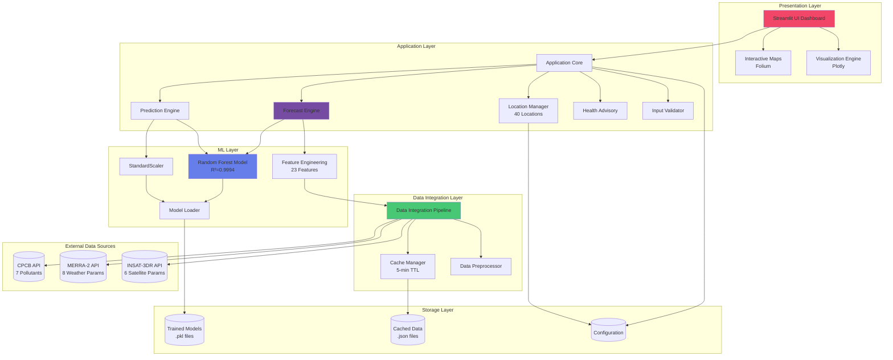
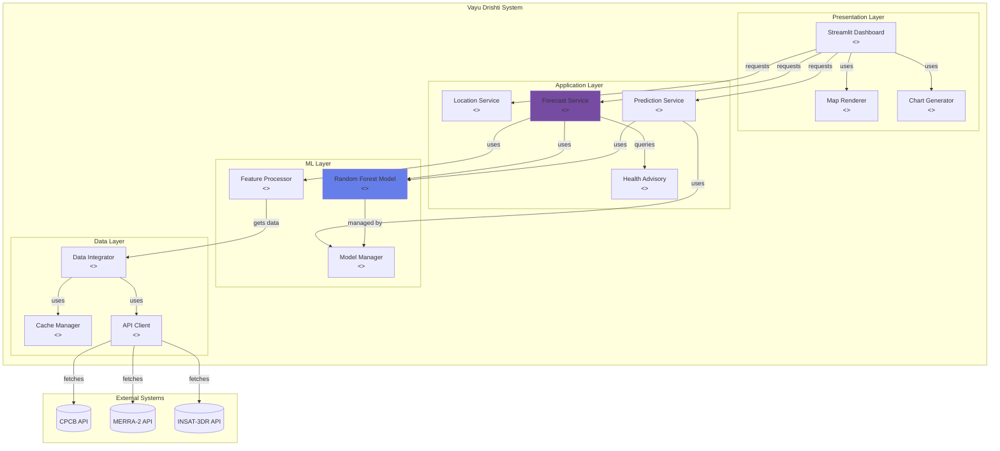

# Component Diagram - Vayu Drishti Air Quality Visualizer

## System Architecture

### Mermaid Diagram



## Component Details

### Mermaid C4 Component Diagram



## PlantUML Code

```plantuml
@startuml
!include https://raw.githubusercontent.com/plantuml-stdlib/C4-PlantUML/master/C4_Component.puml

title Component Diagram - Vayu Drishti Air Quality Visualizer

Container_Boundary(ui, "Presentation Layer") {
    Component(dashboard, "Streamlit Dashboard", "Python, Streamlit", "Main user interface with 6 pages")
    Component(maps, "Map Component", "Folium", "Interactive map visualization")
    Component(charts, "Chart Component", "Plotly", "Dynamic charts and graphs")
}

Container_Boundary(app, "Application Layer") {
    Component(location, "Location Manager", "Python", "Manages 40 locations (10 cities + 30 rural)")
    Component(forecast, "Forecast Engine", "Python", "Generates 1-72 hour forecasts")
    Component(predict, "Prediction Service", "Python", "Handles custom predictions")
    Component(health, "Health Advisory", "Python", "Provides health recommendations")
}

Container_Boundary(ml, "ML Layer") {
    Component(rf, "Random Forest Model", "Scikit-learn", "R²=0.9994, RMSE=4.57")
    Component(scaler, "Feature Scaler", "StandardScaler", "Normalizes input features")
    Component(features, "Feature Engineering", "NumPy/Pandas", "23 features from 3 sources")
}

Container_Boundary(data, "Data Integration Layer") {
    Component(pipeline, "Data Pipeline", "Python", "Integrates multiple data sources")
    Component(cache, "Cache Manager", "JSON Cache", "5-minute TTL caching")
    Component(preprocess, "Preprocessor", "Pandas", "Data cleaning and transformation")
}

ContainerDb(models, "Model Storage", "File System", "Trained models (.pkl)")
ContainerDb(datacache, "Data Cache", "File System", "Cached API responses (.json)")

System_Ext(cpcb, "CPCB API", "7 pollutants data")
System_Ext(merra2, "MERRA-2 API", "8 meteorological parameters")
System_Ext(insat, "INSAT-3DR API", "6 satellite parameters")

Rel(dashboard, location, "Uses")
Rel(dashboard, forecast, "Requests forecast")
Rel(dashboard, predict, "Requests prediction")
Rel(dashboard, maps, "Renders")
Rel(dashboard, charts, "Displays")

Rel(forecast, rf, "Uses for prediction")
Rel(forecast, features, "Prepares features")
Rel(predict, rf, "Uses for prediction")
Rel(predict, scaler, "Scales input")

Rel(rf, models, "Loads from")
Rel(scaler, models, "Loads from")
Rel(features, pipeline, "Gets data from")

Rel(pipeline, cache, "Uses")
Rel(pipeline, preprocess, "Uses")
Rel(cache, datacache, "Stores/Retrieves")

Rel(pipeline, cpcb, "Fetches data")
Rel(pipeline, merra2, "Fetches data")
Rel(pipeline, insat, "Fetches data")

Rel(forecast, health, "Gets advisory")

@enduml
```

## Component Descriptions

### 1. Presentation Layer Components

#### Streamlit Dashboard
- **Technology**: Python, Streamlit
- **Responsibilities**:
  - Render 6 different pages (Dashboard, Map, Predictions, etc.)
  - Handle user interactions (location selection, forecast horizon)
  - Display AQI with color-coded categories
  - Manage application state
- **Interfaces**: HTTP/WebSocket

#### Map Component (Folium)
- **Technology**: Folium, Leaflet.js
- **Responsibilities**:
  - Render interactive maps with AQI markers
  - Display 40 locations (cities + rural areas)
  - Color-code markers by AQI category
- **Interfaces**: JavaScript API

#### Chart Component (Plotly)
- **Technology**: Plotly.js, Python
- **Responsibilities**:
  - Generate time-series forecast charts
  - Create pollutant trend visualizations
  - Display feature importance plots
  - Render confidence intervals
- **Interfaces**: JSON data

### 2. Application Layer Components

#### Location Manager
- **Responsibilities**:
  - Manage 10 major cities and 30 rural areas
  - Store coordinates and metadata
  - Provide location lookup and validation
- **Data**: 40 locations with lat/lon

#### Forecast Engine
- **Responsibilities**:
  - Generate 1-72 hour AQI forecasts
  - Calculate confidence intervals (±4.57 AQI)
  - Handle temporal patterns (diurnal, weekly)
  - Aggregate multi-source data
- **Performance**: 8.3s training, <100ms inference

#### Prediction Service
- **Responsibilities**:
  - Handle custom predictions with user inputs
  - Validate 23 input features
  - Scale features using StandardScaler
  - Return predictions with confidence
- **Accuracy**: R²=0.9994

#### Health Advisory
- **Responsibilities**:
  - Categorize AQI (Good/Moderate/Unhealthy/etc.)
  - Generate health recommendations
  - Provide activity suggestions
- **Categories**: 6 AQI ranges

### 3. ML Layer Components

#### Random Forest Model
- **Technology**: Scikit-learn RandomForestRegressor
- **Specifications**:
  - 100 estimators, max_depth=20
  - R²=0.9994, RMSE=4.57, MAE=2.33
  - Training: 53,390 samples
  - Features: 23 (CPCB + MERRA-2 + INSAT-3DR)
- **Model File**: `rf_aqi_model_integrated.pkl`

#### Feature Engineering
- **Responsibilities**:
  - Combine 3 data sources into unified feature vector
  - Handle missing values
  - Create temporal features
  - Apply domain knowledge
- **Output**: 23-feature vector

#### StandardScaler
- **Technology**: Scikit-learn StandardScaler
- **Responsibilities**:
  - Normalize features to zero mean, unit variance
  - Apply same scaling as training data
- **File**: `rf_scaler_integrated.pkl`

### 4. Data Integration Layer Components

#### Data Pipeline
- **Responsibilities**:
  - Fetch data from 3 external APIs
  - Merge data by timestamp and location
  - Handle API failures gracefully
  - Implement retry logic
- **Integration Points**: CPCB, MERRA-2, INSAT-3DR

#### Cache Manager
- **Technology**: JSON file cache
- **Responsibilities**:
  - Cache API responses for 5 minutes
  - Reduce API calls
  - Provide fallback data
  - Manage cache invalidation
- **Storage**: `cache/` directory

#### Data Preprocessor
- **Responsibilities**:
  - Clean and validate data
  - Handle outliers
  - Impute missing values
  - Transform data types
- **Technology**: Pandas, NumPy

## Component Interactions

### Forecast Generation Flow
1. User selects location → Location Manager
2. Location Manager → Data Pipeline (fetch data)
3. Data Pipeline → Cache Manager (check cache)
4. Data Pipeline → External APIs (if cache miss)
5. Data Pipeline → Feature Engineering (prepare features)
6. Feature Engineering → Random Forest Model (predict)
7. Random Forest → Forecast Engine (AQI values)
8. Forecast Engine → Chart Component (visualize)
9. Chart Component → Dashboard (display)

### Custom Prediction Flow
1. User inputs parameters → Prediction Service
2. Prediction Service → Feature Engineering (validate & prepare)
3. Feature Engineering → StandardScaler (scale)
4. StandardScaler → Random Forest Model (predict)
5. Random Forest → Health Advisory (categorize)
6. Health Advisory → Dashboard (display with recommendations)

## Technology Stack

| Layer | Technologies |
|-------|-------------|
| **Presentation** | Streamlit, Folium, Plotly, HTML/CSS |
| **Application** | Python 3.8+, NumPy, Pandas |
| **ML** | Scikit-learn, Joblib |
| **Data** | Requests, JSON, File I/O |
| **Storage** | File System (pkl, json) |
| **External APIs** | CPCB, MERRA-2, INSAT-3DR |
