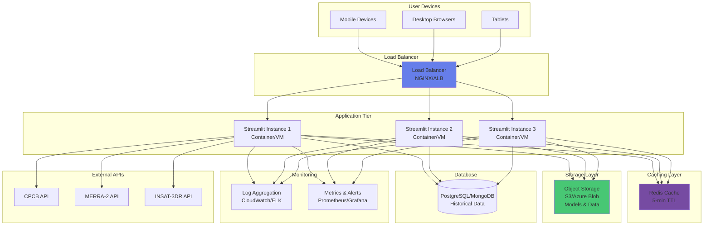

# Deployment Diagram - Vayu Drishti Air Quality Visualizer

## System Deployment Architecture

### Mermaid Diagram

```mermaid
graph TB
    subgraph "Client Environment"
        Browser[Web Browser<br/>Chrome/Firefox/Safari]
    end
    
    subgraph "Streamlit Server"
        subgraph "Application Node"
            StreamlitApp[Streamlit Application<br/>Port 8501]
            AppServer[Python Runtime<br/>Python 3.8+]
        end
        
        subgraph "ML Components"
            RFModel[Random Forest Model<br/>rf_aqi_model_integrated.pkl]
            Scaler[StandardScaler<br/>rf_scaler_integrated.pkl]
            FeatureImportance[Feature Importance<br/>feature_importance_rf.csv]
        end
        
        subgraph "Storage"
            CacheDir[Cache Directory<br/>/cache/*.json]
            ModelDir[Model Directory<br/>/saved_models/*.pkl]
            DataDir[Data Directory<br/>/aqi_web_scraper/*.csv]
        end
    end
    
    subgraph "External Services Cloud"
        CPCB[CPCB API Server<br/>India Pollution Data<br/>HTTPS/REST]
        MERRA2[NASA MERRA-2 API<br/>Meteorological Data<br/>HTTPS/REST]
        INSAT[INSAT-3DR API<br/>Satellite Data<br/>HTTPS/REST]
    end
    
    subgraph "Visualization Libraries"
        Folium[Folium/Leaflet.js<br/>Map Rendering]
        Plotly[Plotly.js<br/>Chart Generation]
    end
    
    Browser -->|HTTP/WebSocket<br/>Port 8501| StreamlitApp
    StreamlitApp -->|loads| RFModel
    StreamlitApp -->|loads| Scaler
    StreamlitApp -->|reads| FeatureImportance
    
    StreamlitApp -->|read/write| CacheDir
    StreamlitApp -->|read| ModelDir
    StreamlitApp -->|read| DataDir
    
    StreamlitApp -->|HTTPS/REST| CPCB
    StreamlitApp -->|HTTPS/REST| MERRA2
    StreamlitApp -->|HTTPS/REST| INSAT
    
    StreamlitApp -->|renders| Folium
    StreamlitApp -->|renders| Plotly
    
    AppServer -->|runs| StreamlitApp
    
    style StreamlitApp fill:#667eea
    style RFModel fill:#764ba2
    style Browser fill:#f14668
    style CPCB fill:#48c774
    style MERRA2 fill:#48c774
    style INSAT fill:#48c774
```



## Cloud Deployment Architecture (Production)



## Container Deployment (Docker)

```mermaid
graph TB
    subgraph "Docker Host"
        subgraph "Streamlit Container"
            App[Streamlit App<br/>Python 3.8+]
            Deps[Dependencies<br/>requirements.txt]
            Models[ML Models<br/>Volume Mount]
            Cache[Cache<br/>Volume Mount]
        end
        
        subgraph "Volumes"
            V1[/models<br/>Persistent Volume]
            V2[/cache<br/>Persistent Volume]
            V3[/data<br/>Persistent Volume]
        end
    end
    
    subgraph "Container Registry"
        Registry[Docker Hub/<br/>AWS ECR/<br/>Azure ACR]
    end
    
    subgraph "External"
        APIs[External APIs]
    end
    
    Models --> V1
    Cache --> V2
    
    App --> APIs
    
    Registry -.->|pull image| App
    
    style App fill:#667eea
    style V1 fill:#48c774
    style V2 fill:#48c774
```

## PlantUML Code

```plantuml
@startuml
!include https://raw.githubusercontent.com/plantuml-stdlib/C4-PlantUML/master/C4_Deployment.puml

title Deployment Diagram - Vayu Drishti Air Quality Visualizer

Deployment_Node(client, "Client Device", "Windows/Mac/Linux/Mobile") {
    Container(browser, "Web Browser", "Chrome, Firefox, Safari", "Displays interactive dashboard")
}

Deployment_Node(server, "Streamlit Server", "Linux/Windows Server") {
    Deployment_Node(runtime, "Python Runtime", "Python 3.8+") {
        Container(app, "Streamlit Application", "Python, Streamlit", "Main application server")
    }
    
    Deployment_Node(ml, "ML Components", "File System") {
        Component(model, "Random Forest Model", "Scikit-learn", "rf_aqi_model_integrated.pkl")
        Component(scaler, "StandardScaler", "Scikit-learn", "rf_scaler_integrated.pkl")
    }
    
    Deployment_Node(storage, "Storage", "File System") {
        ContainerDb(cache, "Cache Directory", "JSON Files", "5-min cached data")
        ContainerDb(models_dir, "Model Directory", "PKL Files", "Trained models")
        ContainerDb(data, "Data Directory", "CSV Files", "Training data")
    }
}

Deployment_Node(external, "External Services", "Cloud") {
    System_Ext(cpcb, "CPCB API", "Pollution data")
    System_Ext(merra2, "MERRA-2 API", "Weather data")
    System_Ext(insat, "INSAT-3DR API", "Satellite data")
}

Deployment_Node(viz, "Visualization Libraries", "JavaScript") {
    Component(folium, "Folium/Leaflet", "Map rendering")
    Component(plotly, "Plotly.js", "Chart generation")
}

Rel(browser, app, "Uses", "HTTP/WebSocket:8501")
Rel(app, model, "Loads")
Rel(app, scaler, "Loads")
Rel(app, cache, "Read/Write")
Rel(app, models_dir, "Read")
Rel(app, data, "Read")

Rel(app, cpcb, "Fetches", "HTTPS/REST")
Rel(app, merra2, "Fetches", "HTTPS/REST")
Rel(app, insat, "Fetches", "HTTPS/REST")

Rel(app, folium, "Renders")
Rel(app, plotly, "Renders")
Rel(browser, folium, "Displays")
Rel(browser, plotly, "Displays")

@enduml
```

## Deployment Configurations

### Local Development Deployment

```yaml
Environment: Local Machine
Platform: Windows/Mac/Linux
Python Version: 3.8+
Port: 8501
Command: streamlit run streamlit_app_rf_integrated.py

Dependencies:
  - streamlit==1.28.0
  - pandas==2.0.0
  - numpy==1.24.0
  - scikit-learn==1.3.0
  - plotly==5.17.0
  - folium==0.14.0
  - joblib==1.3.0

Directory Structure:
  /ml_model_1/
    ├── streamlit_app_rf_integrated.py (Main app)
    ├── train_random_forest_integrated.py (Training script)
    ├── cache/ (API cache)
    ├── saved_models/ (ML models)
    └── aqi_web_scraper/ (Data & models)
```

### Docker Deployment

```dockerfile
FROM python:3.8-slim

WORKDIR /app

# Install dependencies
COPY requirements.txt .
RUN pip install --no-cache-dir -r requirements.txt

# Copy application files
COPY ml_model_1/ .

# Create volumes
VOLUME ["/app/cache", "/app/saved_models", "/app/aqi_web_scraper"]

# Expose Streamlit port
EXPOSE 8501

# Health check
HEALTHCHECK --interval=30s --timeout=10s --start-period=5s --retries=3 \
  CMD curl -f http://localhost:8501/_stcore/health || exit 1

# Run application
CMD ["streamlit", "run", "streamlit_app_rf_integrated.py", \
     "--server.port=8501", \
     "--server.address=0.0.0.0"]
```

### Kubernetes Deployment

```yaml
apiVersion: apps/v1
kind: Deployment
metadata:
  name: vayu-drishti
spec:
  replicas: 3
  selector:
    matchLabels:
      app: vayu-drishti
  template:
    metadata:
      labels:
        app: vayu-drishti
    spec:
      containers:
      - name: streamlit-app
        image: vayu-drishti:latest
        ports:
        - containerPort: 8501
        resources:
          requests:
            memory: "512Mi"
            cpu: "500m"
          limits:
            memory: "2Gi"
            cpu: "2000m"
        volumeMounts:
        - name: models
          mountPath: /app/saved_models
        - name: cache
          mountPath: /app/cache
        env:
        - name: CPCB_API_KEY
          valueFrom:
            secretKeyRef:
              name: api-keys
              key: cpcb-key
      volumes:
      - name: models
        persistentVolumeClaim:
          claimName: models-pvc
      - name: cache
        emptyDir: {}

---
apiVersion: v1
kind: Service
metadata:
  name: vayu-drishti-service
spec:
  type: LoadBalancer
  ports:
  - port: 80
    targetPort: 8501
  selector:
    app: vayu-drishti
```

### Cloud Platform Deployments

#### AWS Deployment
```yaml
Platform: AWS Elastic Beanstalk / ECS / EC2
Services:
  - EC2 t3.medium instances
  - Application Load Balancer (ALB)
  - S3 for model storage
  - ElastiCache Redis for caching
  - CloudWatch for monitoring
  - Route 53 for DNS

Configuration:
  Instance Type: t3.medium (2 vCPU, 4 GB RAM)
  Auto Scaling: 2-5 instances
  Load Balancer: ALB with SSL termination
  Region: ap-south-1 (Mumbai)
```

#### Azure Deployment
```yaml
Platform: Azure App Service / AKS / VM
Services:
  - App Service Plan (P1V2)
  - Azure Blob Storage for models
  - Azure Cache for Redis
  - Application Insights
  - Azure CDN for static assets

Configuration:
  Plan: P1V2 (1 Core, 3.5 GB RAM)
  Auto Scaling: 2-10 instances
  Region: Central India
```

#### Streamlit Cloud Deployment
```yaml
Platform: Streamlit Community Cloud
Configuration:
  Memory: 800 MB
  Storage: 5 GB
  Python: 3.8+
  Deployment: GitHub integration
  
Limitations:
  - Single instance (no load balancing)
  - Limited to 1 GB RAM
  - Public access only
  - GitHub repo required
```

## Network Configuration

### Ports
- **8501**: Streamlit application (HTTP/WebSocket)
- **443**: HTTPS (production with SSL)
- **80**: HTTP redirect to HTTPS
- **6379**: Redis cache (internal)
- **5432**: PostgreSQL (if used, internal)

### Security
- **SSL/TLS**: HTTPS for all production traffic
- **API Keys**: Secure storage of external API credentials
- **CORS**: Configured for allowed origins
- **Rate Limiting**: 100 requests/minute per IP
- **Firewall**: Restrict access to known IPs (optional)

### Firewall Rules
```yaml
Inbound Rules:
  - Port 80: Allow from 0.0.0.0/0
  - Port 443: Allow from 0.0.0.0/0
  - Port 8501: Allow from load balancer only

Outbound Rules:
  - HTTPS (443): Allow to external APIs
  - DNS (53): Allow for name resolution
```

## Scalability & Performance

### Horizontal Scaling
- **Load Balancer**: Distributes traffic across 2-5 instances
- **Stateless Design**: Each instance independent
- **Shared Cache**: Redis for cross-instance caching
- **Session Affinity**: WebSocket connections sticky

### Vertical Scaling
- **CPU**: 2-4 cores recommended
- **RAM**: 4-8 GB per instance
- **Storage**: 10-50 GB for models and cache

### Caching Strategy
- **Application Cache**: 5-minute TTL for API data
- **Redis Cache**: Shared across instances
- **CDN**: Static assets (JS, CSS, images)
- **Browser Cache**: Client-side caching

## Monitoring & Logging

### Metrics
- **Application**: Response time, error rate, active users
- **System**: CPU, memory, disk, network usage
- **ML Model**: Prediction time, accuracy metrics
- **External APIs**: Response time, failure rate

### Logging
- **Application Logs**: Streamlit events, errors
- **Access Logs**: User requests, IP addresses
- **API Logs**: External API calls, responses
- **Audit Logs**: Configuration changes

### Alerts
- **High Error Rate**: >5% errors in 5 minutes
- **High Response Time**: >3s average response
- **Low Disk Space**: <10% free space
- **API Failures**: >10% external API errors

## Backup & Recovery

### Backup Strategy
- **ML Models**: Daily backup to S3/Blob storage
- **Cache Data**: Not backed up (regenerated)
- **Configuration**: Version controlled in Git
- **Database**: Daily snapshots (if applicable)

### Disaster Recovery
- **RTO**: 15 minutes (Recovery Time Objective)
- **RPO**: 24 hours (Recovery Point Objective)
- **Multi-Region**: Active-passive setup
- **Health Checks**: Automatic failover

## Infrastructure as Code

### Terraform Example
```hcl
resource "aws_instance" "vayu_drishti" {
  ami           = "ami-0c55b159cbfafe1f0"
  instance_type = "t3.medium"
  
  tags = {
    Name = "vayu-drishti-app"
  }
}

resource "aws_lb" "vayu_drishti_lb" {
  name               = "vayu-drishti-lb"
  internal           = false
  load_balancer_type = "application"
  
  enable_deletion_protection = true
}
```

## Estimated Costs (Monthly)

| Deployment Type | Infrastructure | Cost (USD) |
|----------------|----------------|------------|
| **Local Dev** | Single machine | $0 |
| **Docker (Self-hosted)** | VPS (4GB RAM) | $20-40 |
| **Streamlit Cloud** | Free tier | $0 |
| **AWS (Production)** | t3.medium × 2 + ALB + S3 | $150-200 |
| **Azure (Production)** | P1V2 × 2 + Redis + Storage | $180-220 |
| **Kubernetes** | AKS/EKS cluster | $200-300 |
