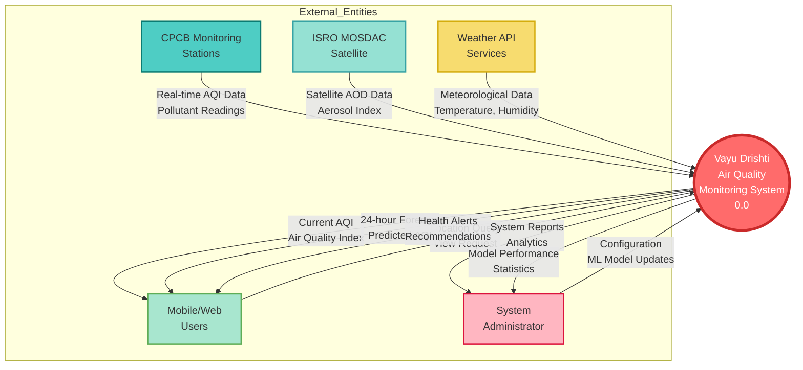
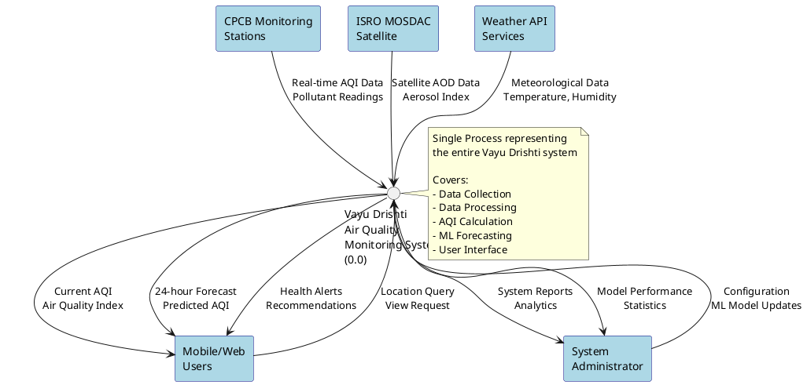
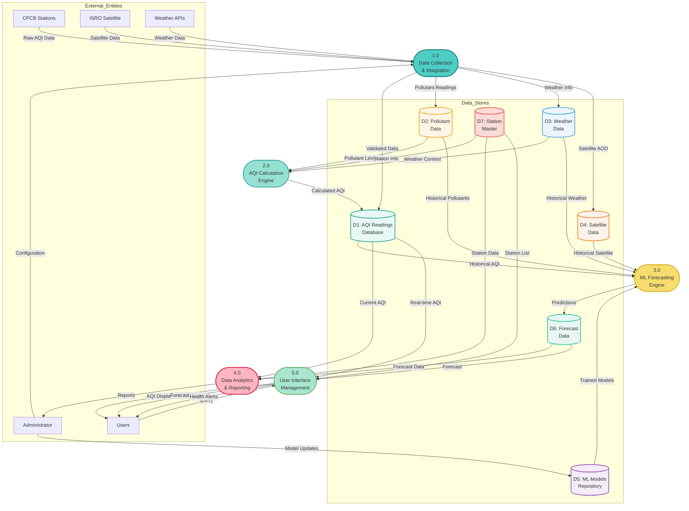
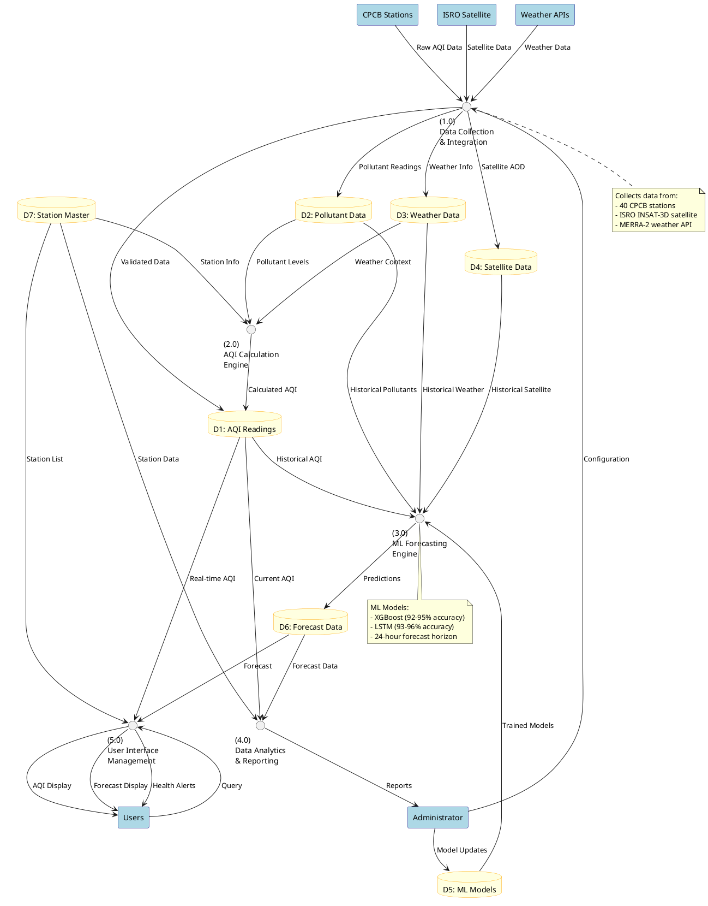
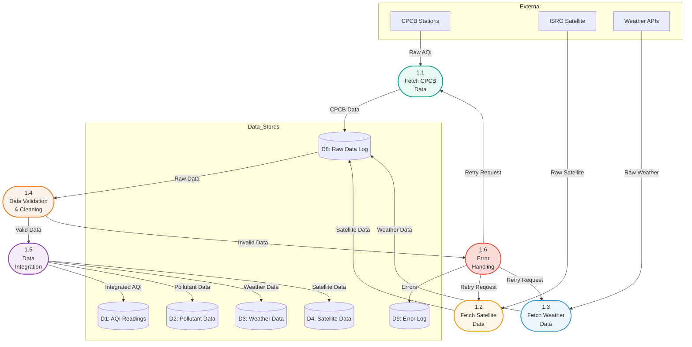
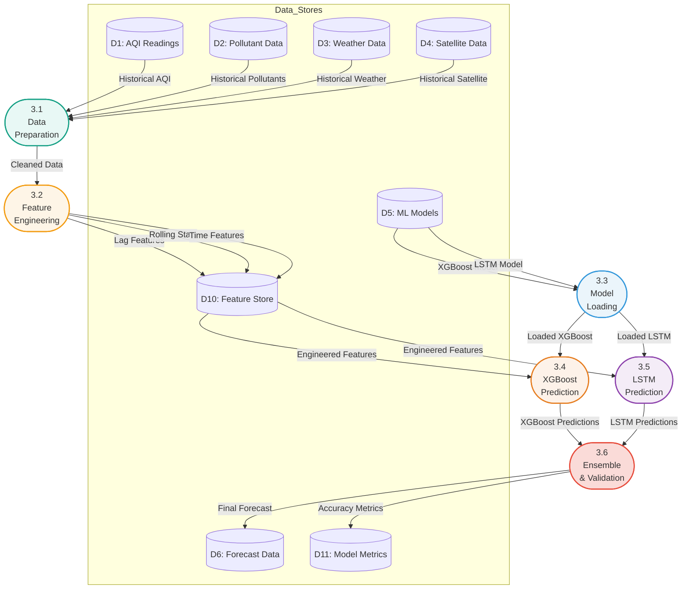
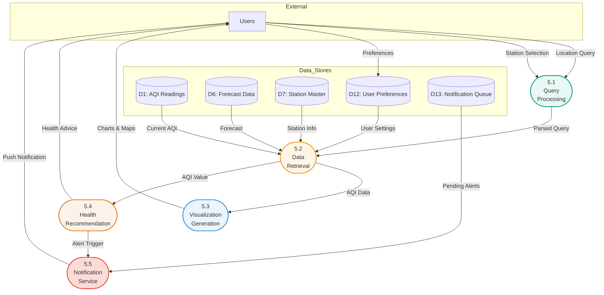

# 📊 Data Flow Diagram (DFD)

## Vayu Drishti - Real-Time Air Quality Visualizer App

**"Swasth Jeevan ki Shrishti!" (Creating Healthy Lives)**

---

## Table of Contents

- [What is DFD?](#what-is-dfd)
- [DFD Components and Symbols](#dfd-components-and-symbols)
- [Level 0 DFD (Context Diagram)](#level-0-dfd-context-diagram)
- [Level 1 DFD](#level-1-dfd)
- [Level 2 DFD](#level-2-dfd)
- [DFD Rules and Conventions](#dfd-rules-and-conventions)
- [Data Dictionary](#data-dictionary)

---

## What is DFD?

A **Data Flow Diagram (DFD)** is a graphical representation of data flow in the Vayu Drishti system. It illustrates:
- **Incoming data flow**: From CPCB stations, ISRO satellites, weather APIs
- **Outgoing data flow**: To mobile apps, web dashboards, ML models
- **Data storage**: AQI readings, forecasts, historical data
- **Data transformations**: AQI calculation, ML predictions, data aggregation

---

## DFD Components and Symbols

According to standard DFD notation:

| Symbol | Name | Description | Representation |
|--------|------|-------------|----------------|
| **Circle/Oval** | Process | Transforms input data to output data | `(P1.0) Process Name` |
| **Arrow** | Data Flow | Movement of data between components | `→ Data Name →` |
| **Parallel Lines** | Data Store | Storage of data for later use | `D1 ‖ Database Name ‖` |
| **Rectangle** | External Entity | External sources/destinations of data | `[Entity Name]` |

### DFD Notation Rules:

✅ **Data CAN flow from:**
- External Entity → Process
- Process → External Entity
- Process → Data Store
- Data Store → Process
- Process → Process

❌ **Data CANNOT flow from:**
- External Entity → External Entity
- External Entity → Data Store
- Data Store → External Entity
- Data Store → Data Store

---

## Level 0 DFD (Context Diagram)

**Purpose**: Shows the entire system as a single process with its relationship to external entities.

### Mermaid Diagram - Level 0



### PlantUML Diagram - Level 0



### Textual Representation - Level 0

```
┌──────────────────┐
│  CPCB Stations   │───── Real-time AQI Data ────┐
└──────────────────┘                             │
                                                  │
┌──────────────────┐                             │
│  ISRO Satellite  │───── Satellite Data ────────┤
└──────────────────┘                             │
                                                  ▼
┌──────────────────┐                    ╔═══════════════════╗
│  Weather APIs    │──── Weather Data ──║   Vayu Drishti    ║
└──────────────────┘                    ║   Air Quality     ║
                                        ║   Monitoring      ║
┌──────────────────┐                    ║   System (0.0)    ║
│   Mobile/Web     │◄── AQI & Forecast ─║                   ║
│     Users        │─── Location Query ─║                   ║
└──────────────────┘                    ╚═══════════════════╝
                                                  ▲
┌──────────────────┐                             │
│ Administrator    │◄──── Reports ───────────────┤
│                  │───── Config ────────────────┘
└──────────────────┘
```

**External Entities**:
1. **CPCB Monitoring Stations**: 40 stations across India
2. **ISRO MOSDAC Satellite**: INSAT-3D satellite data
3. **Weather API Services**: MERRA-2 meteorological data
4. **Mobile/Web Users**: End users viewing AQI
5. **System Administrator**: System management and monitoring

**Data Flows**:
- **Input**: AQI readings, satellite data, weather data, user queries, admin configuration
- **Output**: Current AQI, forecasts, health alerts, reports, statistics

---

## Level 1 DFD

**Purpose**: Breaks down the main system into major functional processes.

### Mermaid Diagram - Level 1



### PlantUML Diagram - Level 1



### Process Descriptions - Level 1

#### **1.0 - Data Collection & Integration**
**Input**: 
- Raw AQI data from CPCB stations (PM2.5, PM10, NO2, SO2, CO, NH3, O3)
- Satellite data from ISRO (AOD, aerosol index, cloud fraction)
- Weather data from APIs (temperature, humidity, wind speed, pressure)

**Process**:
- Validate incoming data (check for missing values, outliers)
- Standardize data formats across sources
- Handle missing data using KNN imputation
- Time-synchronize data from different sources
- Apply data quality checks

**Output**:
- Validated AQI readings → D1
- Pollutant measurements → D2
- Weather information → D3
- Satellite observations → D4

---

#### **2.0 - AQI Calculation Engine**
**Input**:
- Pollutant levels from D2 (PM2.5, PM10, NO2, SO2, CO, O3)
- Weather context from D3
- Station information from D7

**Process**:
- Apply CPCB AQI calculation formula for each pollutant
- Calculate sub-indices for each pollutant
- Determine overall AQI (maximum of all sub-indices)
- Apply weather-based adjustments if needed
- Classify AQI category (Good, Satisfactory, Moderate, Poor, Very Poor, Severe)

**Formula**:
```
AQI = MAX(AQI_PM2.5, AQI_PM10, AQI_NO2, AQI_SO2, AQI_CO, AQI_O3)

For each pollutant:
AQI_p = [(I_high - I_low) / (C_high - C_low)] × (C_p - C_low) + I_low
```

**Output**:
- Calculated AQI with category → D1

---

#### **3.0 - ML Forecasting Engine**
**Input**:
- Historical AQI readings from D1 (320,000+ records)
- Historical pollutant data from D2
- Historical weather data from D3
- Historical satellite data from D4
- Trained ML models from D5 (XGBoost, LSTM)

**Process**:
- Feature engineering (lag features, rolling statistics, time features)
- Load pre-trained XGBoost/LSTM models
- Prepare input sequence (24 timesteps)
- Generate 24-hour ahead predictions
- Calculate confidence intervals
- Validate predictions against thresholds (0-500 AQI range)

**Models**:
- **XGBoost**: R² = 0.92-0.95, RMSE = 12-18
- **LSTM**: R² = 0.93-0.96, RMSE = 10-15

**Output**:
- 24-hour AQI forecasts → D6

---

#### **4.0 - Data Analytics & Reporting**
**Input**:
- Current AQI from D1
- Forecast data from D6
- Station data from D7

**Process**:
- Generate statistical summaries (daily, weekly, monthly)
- Identify AQI trends and patterns
- Detect anomalies and air quality events
- Calculate station-wise performance metrics
- Generate model accuracy reports
- Create data visualizations (charts, maps)

**Output**:
- System reports → Administrator
- Analytics dashboard data
- Model performance statistics

---

#### **5.0 - User Interface Management**
**Input**:
- Real-time AQI from D1
- Forecast data from D6
- Station list from D7
- User queries (location, station selection)

**Process**:
- Process user queries (city, state, station)
- Retrieve relevant AQI and forecast data
- Format data for mobile/web display
- Generate health recommendations based on AQI
- Create interactive maps and charts
- Send push notifications for severe AQI

**Health Recommendations**:
- **Good (0-50)**: Air quality is satisfactory
- **Moderate (51-100)**: Sensitive groups should limit outdoor activity
- **Poor (101-200)**: Everyone should reduce outdoor exertion
- **Very Poor (201-300)**: Avoid outdoor activities
- **Severe (301-500)**: Health alert - stay indoors

**Output**:
- AQI display → Users
- Forecast display → Users
- Health alerts → Users

---

## Level 2 DFD

**Purpose**: Further decomposes Level 1 processes into sub-processes.

### Level 2 DFD - Process 1.0 (Data Collection & Integration)



#### Sub-Process Descriptions - Process 1.0

**1.1 - Fetch CPCB Data**
- Connect to CPCB API (40 monitoring stations)
- Request hourly AQI readings
- Extract pollutant concentrations (PM2.5, PM10, NO2, SO2, CO, NH3, O3)
- Store raw data with timestamp

**1.2 - Fetch Satellite Data**
- Connect to ISRO MOSDAC API
- Request INSAT-3D satellite data
- Extract AOD550, aerosol index, cloud fraction
- Store satellite observations

**1.3 - Fetch Weather Data**
- Connect to MERRA-2 weather API
- Request meteorological data
- Extract temperature, humidity, wind speed, pressure
- Store weather measurements

**1.4 - Data Validation & Cleaning**
- Check for missing values (NA, null)
- Validate data ranges (e.g., PM2.5: 0-500 μg/m³)
- Detect outliers using statistical methods
- Handle missing data (KNN imputation, linear interpolation)
- Flag invalid data for error handling

**1.5 - Data Integration**
- Merge data from all sources by timestamp and station
- Create unified dataset with all features
- Generate composite records
- Distribute to appropriate data stores

**1.6 - Error Handling**
- Log validation errors
- Retry failed API requests (max 3 attempts)
- Send alerts for persistent failures
- Maintain error statistics

---

### Level 2 DFD - Process 3.0 (ML Forecasting Engine)



#### Sub-Process Descriptions - Process 3.0

**3.1 - Data Preparation**
- Load historical data (last 12 months)
- Filter by station and time range
- Handle missing values
- Normalize/scale features
- Create time-series sequences

**3.2 - Feature Engineering**
- **Lag Features**: t-1, t-2, t-3, t-6, t-12, t-24 (previous hours)
- **Rolling Statistics**: Mean and Std for 6h, 12h, 24h windows
- **Time Features**: Hour, day, month (sin/cos encoding), weekend flag
- **Derived Features**: Temperature × Humidity, Wind × Pollutants
- Store engineered features

**3.3 - Model Loading**
- Load pre-trained XGBoost model (.pkl file)
- Load pre-trained LSTM model (.h5 file)
- Load feature scalers
- Verify model versions

**3.4 - XGBoost Prediction**
- Prepare tabular features
- Apply feature scaling
- Run XGBoost inference
- Generate 24-hour predictions
- Calculate prediction confidence

**3.5 - LSTM Prediction**
- Prepare sequence data (24 timesteps)
- Reshape for LSTM input (batch, timesteps, features)
- Run LSTM inference
- Generate 24-hour predictions
- Calculate prediction confidence

**3.6 - Ensemble & Validation**
- Combine XGBoost and LSTM predictions (weighted average)
- Apply post-processing (smooth outliers)
- Validate predictions (0-500 AQI range)
- Calculate confidence intervals
- Store final forecast with metadata

**Ensemble Formula**:
```
Final_AQI = 0.5 × XGBoost_AQI + 0.5 × LSTM_AQI
```

---

### Level 2 DFD - Process 5.0 (User Interface Management)



#### Sub-Process Descriptions - Process 5.0

**5.1 - Query Processing**
- Parse user location (city, state, coordinates)
- Validate station selection
- Extract time range (current, 24h forecast, historical)
- Prepare database queries

**5.2 - Data Retrieval**
- Query current AQI from database
- Fetch forecast data
- Get station metadata (name, location, status)
- Load user preferences (units, language)
- Aggregate data for response

**5.3 - Visualization Generation**
- Create AQI gauge chart (0-500 scale with color bands)
- Generate time-series line chart (historical + forecast)
- Build interactive map with station markers
- Create pollutant breakdown bar chart
- Format data for mobile/web display

**5.4 - Health Recommendation**
- Determine AQI category
- Generate health advice based on category:
  - **Good (0-50)**: "Air quality is good. Enjoy outdoor activities!"
  - **Moderate (51-100)**: "Air quality is acceptable. Sensitive groups should limit prolonged outdoor exposure."
  - **Poor (101-200)**: "Unhealthy for sensitive groups. Everyone should reduce prolonged outdoor exertion."
  - **Very Poor (201-300)**: "Unhealthy. Avoid outdoor activities. Keep air purifiers on."
  - **Severe (301-500)**: "Emergency! Stay indoors. Close windows. Use N95 masks if going out."
- Add activity recommendations (outdoor exercise, window ventilation, mask usage)

**5.5 - Notification Service**
- Check if AQI exceeds user threshold
- Generate push notification message
- Queue notification for delivery
- Send to mobile device (FCM/APNS)
- Log notification delivery status

---

## DFD Rules and Conventions

### Data Flow Rules

✅ **Valid Data Flows**:
1. External Entity → Process (e.g., CPCB → Data Collection)
2. Process → External Entity (e.g., User Interface → Users)
3. Process → Data Store (e.g., AQI Calculation → AQI Database)
4. Data Store → Process (e.g., ML Models → Forecasting Engine)
5. Process → Process (e.g., Data Validation → Data Integration)

❌ **Invalid Data Flows**:
1. External Entity → External Entity (no direct communication)
2. External Entity → Data Store (must go through process)
3. Data Store → External Entity (must go through process)
4. Data Store → Data Store (must go through process)

### Naming Conventions

- **Processes**: Verb phrases (e.g., "Calculate AQI", "Fetch Data")
- **Data Flows**: Noun phrases (e.g., "AQI Reading", "Weather Data")
- **Data Stores**: Noun phrases with D# prefix (e.g., "D1: AQI Database")
- **External Entities**: Noun phrases (e.g., "CPCB Stations", "Users")

### Balancing Rule

Each process explosion (Level 0 → Level 1 → Level 2) must maintain **balance**:
- All inputs to a process at one level must appear as inputs to its sub-processes
- All outputs from a process at one level must appear as outputs from its sub-processes

---

## Data Dictionary

### Data Stores

| ID | Name | Description | Contents | Update Frequency |
|----|------|-------------|----------|------------------|
| **D1** | AQI Readings Database | Stores all AQI readings | reading_id, station_id, timestamp, AQI, category | Hourly |
| **D2** | Pollutant Data | Stores individual pollutant measurements | PM2.5, PM10, NO2, SO2, CO, NH3, O3 | Hourly |
| **D3** | Weather Data | Stores meteorological data | temperature, humidity, wind_speed, pressure | Hourly |
| **D4** | Satellite Data | Stores ISRO satellite observations | AOD550, aerosol_index, cloud_fraction | Daily |
| **D5** | ML Models Repository | Stores trained ML models | XGBoost .pkl, LSTM .h5, scalers | On model update |
| **D6** | Forecast Data | Stores 24-hour AQI forecasts | forecast_id, predicted_AQI, confidence | Every 6 hours |
| **D7** | Station Master | Stores monitoring station metadata | station_id, name, city, state, lat, lon | Static |
| **D8** | Raw Data Log | Temporary storage for raw API data | Raw JSON/XML from APIs | Real-time |
| **D9** | Error Log | Stores data validation errors | error_id, timestamp, error_type, message | On error |
| **D10** | Feature Store | Stores engineered ML features | lag_features, rolling_stats, time_features | Every 6 hours |
| **D11** | Model Metrics | Stores ML model performance metrics | R2_score, RMSE, MAE, accuracy | On prediction |
| **D12** | User Preferences | Stores user settings | user_id, location, alert_threshold | On user update |
| **D13** | Notification Queue | Queue for pending notifications | notification_id, user_id, message, status | Real-time |

### Data Flows

| Name | Source | Destination | Description | Format |
|------|--------|-------------|-------------|--------|
| Raw AQI Data | CPCB Stations | Data Collection (1.0) | Hourly pollutant readings from monitoring stations | JSON |
| Satellite Data | ISRO Satellite | Data Collection (1.0) | INSAT-3D aerosol optical depth data | CSV/HDF5 |
| Weather Data | Weather APIs | Data Collection (1.0) | MERRA-2 meteorological data | JSON |
| Validated Data | Data Collection (1.0) | D1: AQI Readings | Clean, validated AQI readings | Structured |
| Pollutant Readings | Data Collection (1.0) | D2: Pollutant Data | Individual pollutant measurements | Structured |
| Calculated AQI | AQI Calculation (2.0) | D1: AQI Readings | Computed AQI with category | Numeric |
| Historical AQI | D1: AQI Readings | ML Forecasting (3.0) | Past 12 months of AQI data | Time-series |
| Trained Models | D5: ML Models | ML Forecasting (3.0) | XGBoost and LSTM model files | Binary |
| Predictions | ML Forecasting (3.0) | D6: Forecast Data | 24-hour AQI forecast | Numeric array |
| Location Query | Users | User Interface (5.0) | User's city/station selection | Text |
| AQI Display | User Interface (5.0) | Users | Formatted AQI with visualizations | HTML/JSON |
| Health Alerts | User Interface (5.0) | Users | AQI-based health recommendations | Text |
| System Reports | Data Analytics (4.0) | Administrator | Performance and analytics reports | PDF/Dashboard |

### External Entities

| Entity | Type | Description | Interaction |
|--------|------|-------------|-------------|
| **CPCB Stations** | Data Source | Central Pollution Control Board monitoring stations (40 stations) | Provides real-time AQI data |
| **ISRO Satellite** | Data Source | INSAT-3D satellite (MOSDAC) | Provides satellite AOD data |
| **Weather APIs** | Data Source | MERRA-2 weather service | Provides meteorological data |
| **Users** | Data Consumer | Mobile/web application users | Query AQI, receive alerts |
| **Administrator** | System Manager | System admin and ML engineer | Configure system, update models |

### Processes Summary

| Process ID | Name | Primary Function | Performance |
|------------|------|------------------|-------------|
| **1.0** | Data Collection & Integration | Fetch and integrate data from multiple sources | 3-5 sec latency |
| **1.1** | Fetch CPCB Data | Retrieve data from 40 CPCB stations | 1-2 sec per station |
| **1.2** | Fetch Satellite Data | Retrieve INSAT-3D satellite data | 5-10 sec |
| **1.3** | Fetch Weather Data | Retrieve MERRA-2 weather data | 2-3 sec |
| **1.4** | Data Validation & Cleaning | Validate and clean incoming data | < 1 sec |
| **1.5** | Data Integration | Merge data from all sources | < 1 sec |
| **1.6** | Error Handling | Handle failures and retry | Variable |
| **2.0** | AQI Calculation Engine | Calculate AQI from pollutant levels | < 1 sec |
| **3.0** | ML Forecasting Engine | Generate 24-hour AQI forecast | 10-30 sec |
| **3.1** | Data Preparation | Prepare historical data for ML | 2-5 sec |
| **3.2** | Feature Engineering | Create lag, rolling, time features | 5-10 sec |
| **3.3** | Model Loading | Load XGBoost and LSTM models | 1-2 sec |
| **3.4** | XGBoost Prediction | Run XGBoost inference | 2-3 sec |
| **3.5** | LSTM Prediction | Run LSTM inference | 5-8 sec |
| **3.6** | Ensemble & Validation | Combine and validate predictions | < 1 sec |
| **4.0** | Data Analytics & Reporting | Generate reports and analytics | Variable |
| **5.0** | User Interface Management | Handle user interactions | < 1 sec |
| **5.1** | Query Processing | Parse user queries | < 0.5 sec |
| **5.2** | Data Retrieval | Fetch data from databases | 1-2 sec |
| **5.3** | Visualization Generation | Create charts and maps | 1-2 sec |
| **5.4** | Health Recommendation | Generate health advice | < 0.5 sec |
| **5.5** | Notification Service | Send push notifications | 1-3 sec |

---

## System Data Flow Statistics

### Coverage
- **Monitoring Stations**: 40 stations across 16 Indian states
- **Data Points**: 320,000+ hourly AQI readings
- **States Covered**: 16 (North: 14, East: 7, West: 6, South: 9, Central: 4)
- **Features**: 60+ engineered features for ML

### Data Volume
- **Hourly Data Ingestion**: ~40 records/hour (1 per station)
- **Daily Data Ingestion**: ~960 records/day
- **Annual Data Volume**: ~350,000 records/year
- **Database Size**: ~5-10 GB (with 12 months retention)

### Performance Metrics
- **Data Collection Latency**: 3-5 seconds
- **AQI Calculation Time**: < 1 second
- **Forecast Generation Time**: 10-30 seconds
- **User Query Response Time**: 1-3 seconds
- **API Uptime**: 99.5% target

### ML Model Performance
- **XGBoost R² Score**: 0.92-0.95 (92-95% accuracy)
- **LSTM R² Score**: 0.93-0.96 (93-96% accuracy)
- **Forecast Horizon**: 24 hours ahead
- **Model Update Frequency**: Monthly (or on demand)

---

## Conclusion

This comprehensive DFD documentation for **Vayu Drishti - Real-Time Air Quality Visualizer App** provides:

✅ **Level 0 (Context Diagram)**: High-level system overview with external entities  
✅ **Level 1 DFD**: Five major processes with data stores  
✅ **Level 2 DFD**: Detailed sub-processes for critical operations  
✅ **Data Dictionary**: Complete description of all data elements  
✅ **DFD Rules**: Standard conventions and validation rules  

The system integrates data from 40 CPCB monitoring stations, ISRO satellites, and weather APIs to provide real-time AQI monitoring and 24-hour ML-based forecasts with 92-96% accuracy.

**Designed for**: Vayu Drishti - "Swasth Jeevan ki Shrishti!" 🌬️  
**Created by**: Vayu Drishti Development Team  
**Date**: November 2025
