# 🗄️ Entity-Relationship (ER) Diagram

## Vayu Drishti - Real-Time Air Quality Visualizer App

---

## Complete ER Diagram (Mermaid)


---

## Alternative ER Diagram (PlantUML)


---

## Entities and Attributes

### 1. **MONITORING_STATION** (Strong Entity)
Primary Key: <u>station_id</u>

```
                    ┌──────────────┐
                    │   COUNTRY    │
                    └──────────────┘
                           │
                    ┌──────────────┐
                    │    STATE     │
                    └──────────────┘
                           │
      ┌────────────────────┼────────────────────┐
      │                    │                    │
┌──────────┐      ┌─────────────────┐     ┌──────────┐
│   CITY   │      │ MONITORING_     │     │ LATITUDE │
└──────────┘      │   STATION       │     └──────────┘
                  │                 │
                  └─────────────────┘
                           │
      ┌────────────────────┼────────────────────┐
      │                    │                    │
┌───────────┐    ┌──────────────┐      ┌─────────────┐
│ LONGITUDE │    │ <u>STATION_ID</u> │      │ STATION_NAME│
└───────────┘    └──────────────┘      └─────────────┘
```

**Attributes:**
- <u>station_id</u> (Primary Key)
- station_name
- city
- state
- country
- latitude
- longitude

---

### 2. **AQI_READING** (Weak Entity - depends on MONITORING_STATION)
Primary Key: <u>reading_id</u>
Foreign Key: station_id

```
                    ┌─────────────┐
                    │ LAST_UPDATE │
                    └─────────────┘
                           │
      ┌────────────────────┼────────────────────┐
      │                    │                    │
┌──────────────┐  ╔═══════════════════╗  ┌─────────────┐
│ <u>READING_ID</u> │  ║   AQI_READING     ║  │ TIMESTAMP   │
└──────────────┘  ║   (Weak Entity)   ║  └─────────────┘
                  ╔═══════════════════╗
                           │
      ┌────────────────────┼────────────────────┐
      │                    │                    │
┌──────────┐      ┌─────────────┐      ┌─────────────┐
│   AQI    │      │ STATION_ID  │      │  HAS_CPCB   │
│ (Derived)│      │  (FK)       │      └─────────────┘
└┄┄┄┄┄┄┄┄┄┄┘      └─────────────┘
```

**Attributes:**
- <u>reading_id</u> (Primary Key)
- station_id (Foreign Key)
- timestamp
- last_update
- AQI (Derived Attribute - calculated from pollutant levels)
- has_cpcb (Boolean flag)

---

### 3. **POLLUTANT_DATA** (Strong Entity)
Primary Key: <u>pollutant_data_id</u>
Foreign Key: reading_id

```
      ┌────────────────────────────────────────┐
      │                                        │
┌─────────────┐                       ┌──────────────┐
│    PM2.5    │                       │    PM10      │
└─────────────┘                       └──────────────┘
      │                                        │
      │         ┌─────────────────┐            │
      └─────────│  POLLUTANT_DATA │────────────┘
                │                 │
                └─────────────────┘
                         │
      ┌──────────────────┼──────────────────┐
      │                  │                  │
┌──────────┐    ┌──────────────────┐   ┌──────────┐
│   NO2    │    │ <u>POLLUTANT_DATA</u>│   │   SO2    │
└──────────┘    │      <u>_ID</u>        │   └──────────┘
                └──────────────────┘
      ┌──────────────────┼──────────────────┐
      │                  │                  │
┌──────────┐    ┌──────────────┐      ┌──────────┐
│    CO    │    │  READING_ID  │      │  OZONE   │
└──────────┘    │    (FK)      │      └──────────┘
                └──────────────┘
```

**Attributes:**
- <u>pollutant_data_id</u> (Primary Key)
- reading_id (Foreign Key)
- PM2_5
- PM10
- NO2
- SO2
- CO
- NH3
- OZONE
- pollutant_min
- pollutant_max
- pollutant_avg

---

### 4. **METEOROLOGICAL_DATA** (Strong Entity)
Primary Key: <u>weather_data_id</u>
Foreign Key: reading_id

```
                  ┌──────────────┐
                  │ TEMPERATURE  │
                  └──────────────┘
                         │
      ┌──────────────────┼──────────────────┐
      │                  │                  │
┌──────────┐    ┌──────────────────┐   ┌──────────┐
│ HUMIDITY │    │ METEOROLOGICAL_  │   │   WIND   │
└──────────┘    │      DATA        │   │  SPEED   │
                │                  │   └──────────┘
                └──────────────────┘
                         │
      ┌──────────────────┼──────────────────┐
      │                  │                  │
┌──────────────┐ ┌──────────────────┐ ┌─────────────┐
│   PRESSURE   │ │ <u>WEATHER_DATA_ID</u>│ │    WIND     │
└──────────────┘ └──────────────────┘ │  DIRECTION  │
                                      └─────────────┘
      ┌──────────────────┼──────────────────┐
      │                  │                  │
┌──────────────────┐ ┌──────────────┐ ╔════════════════╗
│ PRECIPITATION    │ │ READING_ID   │ ║ HAS_MERRA2     ║
└──────────────────┘ │   (FK)       │ ║ (Multi-valued) ║
                     └──────────────┘ ╚════════════════╝
```

**Attributes:**
- <u>weather_data_id</u> (Primary Key)
- reading_id (Foreign Key)
- temperature
- humidity
- wind_speed
- wind_direction
- pressure
- precipitation
- boundary_layer_height
- surface_pressure
- has_merra2 (Boolean flag)

---

### 5. **SATELLITE_DATA** (Strong Entity)
Primary Key: <u>satellite_data_id</u>
Foreign Key: reading_id

```
                  ┌──────────────┐
                  │   AOD550     │
                  │ (Aerosol     │
                  │  Optical     │
                  │  Depth)      │
                  └──────────────┘
                         │
      ┌──────────────────┼──────────────────┐
      │                  │                  │
┌──────────────┐  ┌──────────────┐  ┌─────────────────┐
│  AEROSOL     │  │  SATELLITE_  │  │  CLOUD_FRACTION │
│   INDEX      │  │     DATA     │  └─────────────────┘
└──────────────┘  │              │
                  └──────────────┘
                         │
      ┌──────────────────┼──────────────────┐
      │                  │                  │
┌──────────────────┐ ┌─────────────────┐ ┌────────────────┐
│ <u>SATELLITE_DATA</u> │ │   READING_ID    │ │  ANGSTROM      │
│      <u>_ID</u>        │ │     (FK)        │ │  EXPONENT      │
└──────────────────┘ └─────────────────┘ └────────────────┘
      ┌──────────────────┼──────────────────┐
      │                  │                  │
┌──────────────────┐ ┌───────────────────┐ ╔════════════════╗
│   SURFACE        │ │    SINGLE         │ ║  HAS_INSAT     ║
│  REFLECTANCE     │ │   SCATTERING      │ ║ (Multi-valued) ║
└──────────────────┘ │    ALBEDO         │ ╚════════════════╝
                     └───────────────────┘
```

**Attributes:**
- <u>satellite_data_id</u> (Primary Key)
- reading_id (Foreign Key)
- aod550 (Aerosol Optical Depth at 550nm)
- aerosol_index
- cloud_fraction
- surface_reflectance
- angstrom_exponent
- single_scattering_albedo
- has_insat (Boolean flag)

---

### 6. **ML_MODEL** (Strong Entity)
Primary Key: <u>model_id</u>

```
                  ┌──────────────┐
                  │  MODEL_NAME  │
                  └──────────────┘
                         │
      ┌──────────────────┼──────────────────┐
      │                  │                  │
┌──────────────┐  ┌──────────────┐  ┌─────────────────┐
│ MODEL_TYPE   │  │   ML_MODEL   │  │  MODEL_VERSION  │
│ (XGBoost/    │  │              │  └─────────────────┘
│  LSTM)       │  └──────────────┘
└──────────────┘         │
      ┌──────────────────┼──────────────────┐
      │                  │                  │
┌──────────────┐  ┌──────────────┐  ┌─────────────────┐
│ <u>MODEL_ID</u>    │  │ TRAINED_DATE │  │   R2_SCORE      │
└──────────────┘  └──────────────┘  └─────────────────┘
                         │
      ┌──────────────────┼──────────────────┐
      │                  │                  │
┌──────────────┐  ┌──────────────┐  ┌─────────────────┐
│    RMSE      │  │     MAE      │  │  MODEL_FILE_PATH│
└──────────────┘  └──────────────┘  └─────────────────┘
```

**Attributes:**
- <u>model_id</u> (Primary Key)
- model_name
- model_type (XGBoost, LSTM, TFLite)
- model_version
- trained_date
- r2_score
- rmse
- mae
- model_file_path

---

### 7. **FORECAST** (Strong Entity)
Primary Key: <u>forecast_id</u>
Foreign Key: station_id, model_id

```
                  ┌──────────────┐
                  │ FORECAST_    │
                  │  TIMESTAMP   │
                  └──────────────┘
                         │
      ┌──────────────────┼──────────────────┐
      │                  │                  │
┌──────────────┐  ┌──────────────┐  ┌─────────────────┐
│ <u>FORECAST_ID</u> │  │   FORECAST   │  │ PREDICTED_AQI   │
└──────────────┘  │              │  └─────────────────┘
                  └──────────────┘
                         │
      ┌──────────────────┼──────────────────┐
      │                  │                  │
┌──────────────┐  ┌──────────────┐  ┌─────────────────┐
│ STATION_ID   │  │  MODEL_ID    │  │ FORECAST_HORIZON│
│   (FK)       │  │    (FK)      │  │   (24 hours)    │
└──────────────┘  └──────────────┘  └─────────────────┘
                         │
                  ┌──────────────┐
                  │ CONFIDENCE   │
                  │   INTERVAL   │
                  └──────────────┘
```

**Attributes:**
- <u>forecast_id</u> (Primary Key)
- station_id (Foreign Key)
- model_id (Foreign Key)
- forecast_timestamp
- predicted_aqi
- forecast_horizon (24 hours)
- confidence_interval

---

## Relationships

### 1. **MONITORS** (One-to-Many)
**Relationship**: MONITORING_STATION **monitors** AQI_READING

```
┌─────────────────┐                    ╔═══════════════════╗
│ MONITORING_     │        1           ║   AQI_READING     ║
│   STATION       ├──────────────────◇─║   (Weak Entity)   ║
│                 │                    ║                   ║
└─────────────────┘       MONITORS     ╚═══════════════════╝
                      (Identifying
                       Relationship)
```

**Cardinality**: 1:N (One-to-Many)
- One monitoring station can have many AQI readings
- Each AQI reading belongs to exactly one monitoring station
- **Total Participation** from AQI_READING (every reading must belong to a station)
- **Partial Participation** from MONITORING_STATION (a station may not have readings yet)

---

### 2. **HAS_POLLUTANT** (One-to-One)
**Relationship**: AQI_READING **has_pollutant** POLLUTANT_DATA

```
╔═══════════════════╗                  ┌─────────────────┐
║   AQI_READING     ║        1:1       │  POLLUTANT_DATA │
║                   ├──────────────────┤                 │
║                   ║                  │                 │
╚═══════════════════╝  HAS_POLLUTANT   └─────────────────┘
```

**Cardinality**: 1:1 (One-to-One)
- Each AQI reading has exactly one pollutant data record
- Each pollutant data record belongs to exactly one AQI reading
- **Total Participation** from both sides

---

### 3. **HAS_WEATHER** (One-to-One)
**Relationship**: AQI_READING **has_weather** METEOROLOGICAL_DATA

```
╔═══════════════════╗                  ┌──────────────────┐
║   AQI_READING     ║        1:1       │ METEOROLOGICAL_  │
║                   ├──────────────────┤      DATA        │
║                   ║                  │                  │
╚═══════════════════╝  HAS_WEATHER     └──────────────────┘
```

**Cardinality**: 1:1 (One-to-One)
- Each AQI reading has exactly one meteorological data record
- Each meteorological data record belongs to exactly one AQI reading
- **Total Participation** from both sides

---

### 4. **HAS_SATELLITE** (One-to-One)
**Relationship**: AQI_READING **has_satellite** SATELLITE_DATA

```
╔═══════════════════╗                  ┌─────────────────┐
║   AQI_READING     ║        1:1       │  SATELLITE_DATA │
║                   ├──────────────────┤                 │
║                   ║                  │                 │
╚═══════════════════╝  HAS_SATELLITE   └─────────────────┘
```

**Cardinality**: 1:1 (One-to-One)
- Each AQI reading has exactly one satellite data record
- Each satellite data record belongs to exactly one AQI reading
- **Partial Participation** (some readings may not have satellite data)

---

### 5. **GENERATES** (One-to-Many)
**Relationship**: ML_MODEL **generates** FORECAST

```
┌──────────────┐                       ┌─────────────────┐
│   ML_MODEL   │          1            │    FORECAST     │
│              ├───────────────────────┤                 │
│              │                       │                 │
└──────────────┘       GENERATES       └─────────────────┘
                           N
```

**Cardinality**: 1:N (One-to-Many)
- One ML model can generate many forecasts
- Each forecast is generated by exactly one model
- **Total Participation** from FORECAST

---

### 6. **FORECASTS_FOR** (Many-to-One)
**Relationship**: FORECAST **forecasts_for** MONITORING_STATION

```
┌─────────────────┐                    ┌─────────────────┐
│    FORECAST     │          N         │ MONITORING_     │
│                 ├────────────────────┤   STATION       │
│                 │                    │                 │
└─────────────────┘   FORECASTS_FOR    └─────────────────┘
                           1
```

**Cardinality**: N:1 (Many-to-One)
- Many forecasts can be for one monitoring station
- Each forecast is for exactly one monitoring station
- **Total Participation** from FORECAST

---

## Detailed ER Diagram with Attributes (Mermaid)

```mermaid
graph TB
    subgraph "Core Entities"
        MS[MONITORING_STATION<br/>━━━━━━━━━━━━━━━━<br/>🔑 station_id PK<br/>📍 station_name<br/>📍 city, state, country<br/>📍 latitude, longitude]
        
        AR[AQI_READING Weak Entity<br/>━━━━━━━━━━━━━━━━<br/>🔑 reading_id PK<br/>🔗 station_id FK<br/>⏰ timestamp<br/>⏰ last_update<br/>📊 aqi derived<br/>✓ has_cpcb]
    end
    
    subgraph "Data Entities"
        PD[POLLUTANT_DATA<br/>━━━━━━━━━━━━━━━━<br/>🔑 pollutant_data_id PK<br/>🔗 reading_id FK<br/>💨 PM2.5, PM10<br/>💨 NO2, SO2, CO<br/>💨 NH3, OZONE<br/>📈 min, max, avg]
        
        MD[METEOROLOGICAL_DATA<br/>━━━━━━━━━━━━━━━━<br/>🔑 weather_data_id PK<br/>🔗 reading_id FK<br/>🌡️ temperature<br/>💧 humidity<br/>💨 wind_speed, wind_direction<br/>🔽 pressure, precipitation<br/>📏 boundary_layer_height<br/>✓ has_merra2]
        
        SD[SATELLITE_DATA<br/>━━━━━━━━━━━━━━━━<br/>🔑 satellite_data_id PK<br/>🔗 reading_id FK<br/>🛰️ aod550<br/>🛰️ aerosol_index<br/>☁️ cloud_fraction<br/>🌍 surface_reflectance<br/>📐 angstrom_exponent<br/>🔆 single_scattering_albedo<br/>✓ has_insat]
    end
    
    subgraph "ML & Forecasting"
        ML[ML_MODEL<br/>━━━━━━━━━━━━━━━━<br/>🔑 model_id PK<br/>🤖 model_name<br/>🤖 model_type<br/>📌 model_version<br/>📅 trained_date<br/>📊 r2_score, rmse, mae<br/>📁 model_file_path]
        
        FC[FORECAST<br/>━━━━━━━━━━━━━━━━<br/>🔑 forecast_id PK<br/>🔗 station_id FK<br/>🔗 model_id FK<br/>⏰ forecast_timestamp<br/>📊 predicted_aqi<br/>⏱️ forecast_horizon<br/>📈 confidence_interval]
    end
    
    MS -->|"1:N<br/>MONITORS<br/>(identifying)"| AR
    AR -->|"1:1<br/>HAS_POLLUTANT"| PD
    AR -->|"1:1<br/>HAS_WEATHER"| MD
    AR -->|"1:1<br/>HAS_SATELLITE"| SD
    ML -->|"1:N<br/>GENERATES"| FC
    MS -->|"1:N<br/>FORECASTS_FOR"| FC
    FC -.->|"N:1"| ML
    
    style MS fill:#90EE90,stroke:#228B22,stroke-width:3px
    style AR fill:#FFB6C1,stroke:#DC143C,stroke-width:3px,stroke-dasharray: 5 5
    style PD fill:#87CEEB,stroke:#4682B4,stroke-width:2px
    style MD fill:#DDA0DD,stroke:#9370DB,stroke-width:2px
    style SD fill:#F0E68C,stroke:#DAA520,stroke-width:2px
    style ML fill:#FFA07A,stroke:#FF6347,stroke-width:2px
    style FC fill:#98FB98,stroke:#32CD32,stroke-width:2px
```



---

## Participation Constraints

### Total Participation (Double Line)
1. **AQI_READING → MONITORING_STATION**: Every AQI reading must belong to a monitoring station
2. **AQI_READING → POLLUTANT_DATA**: Every AQI reading must have pollutant data
3. **AQI_READING → METEOROLOGICAL_DATA**: Every AQI reading must have weather data
4. **FORECAST → ML_MODEL**: Every forecast must be generated by a model
5. **FORECAST → MONITORING_STATION**: Every forecast must be for a station

### Partial Participation (Single Line)
1. **MONITORING_STATION → AQI_READING**: A station may not have readings yet (newly added stations)
2. **AQI_READING → SATELLITE_DATA**: Some readings may not have satellite data (data unavailability)
3. **ML_MODEL → FORECAST**: A model may exist without generating forecasts yet (newly trained)

---

## Cardinality Summary Table

| Relationship         | From Entity           | To Entity                | Cardinality | Type        |
|----------------------|----------------------|--------------------------|-------------|-------------|
| MONITORS             | MONITORING_STATION   | AQI_READING              | 1:N         | Identifying |
| HAS_POLLUTANT        | AQI_READING          | POLLUTANT_DATA           | 1:1         | Binary      |
| HAS_WEATHER          | AQI_READING          | METEOROLOGICAL_DATA      | 1:1         | Binary      |
| HAS_SATELLITE        | AQI_READING          | SATELLITE_DATA           | 1:1         | Binary      |
| GENERATES            | ML_MODEL             | FORECAST                 | 1:N         | Binary      |
| FORECASTS_FOR        | FORECAST             | MONITORING_STATION       | N:1         | Binary      |

---

## Key Constraints

### Primary Keys
- **MONITORING_STATION**: station_id
- **AQI_READING**: reading_id
- **POLLUTANT_DATA**: pollutant_data_id
- **METEOROLOGICAL_DATA**: weather_data_id
- **SATELLITE_DATA**: satellite_data_id
- **ML_MODEL**: model_id
- **FORECAST**: forecast_id

### Foreign Keys
- **AQI_READING**: station_id → MONITORING_STATION(station_id)
- **POLLUTANT_DATA**: reading_id → AQI_READING(reading_id)
- **METEOROLOGICAL_DATA**: reading_id → AQI_READING(reading_id)
- **SATELLITE_DATA**: reading_id → AQI_READING(reading_id)
- **FORECAST**: station_id → MONITORING_STATION(station_id)
- **FORECAST**: model_id → ML_MODEL(model_id)

### Unique Constraints
- **MONITORING_STATION**: (station_name, city, state) - No duplicate stations
- **AQI_READING**: (station_id, timestamp) - No duplicate readings for same time
- **FORECAST**: (station_id, forecast_timestamp, model_id) - No duplicate forecasts

---

## Derived Attributes

### AQI Calculation (Derived from Pollutant Data)
The AQI value is **derived** from pollutant concentrations using CPCB formula:

```
AQI = MAX(
    AQI(PM2.5),
    AQI(PM10),
    AQI(NO2),
    AQI(SO2),
    AQI(CO),
    AQI(O3)
)
```

Where each pollutant's AQI is calculated using:
```
AQI = [(I_high - I_low) / (C_high - C_low)] × (C - C_low) + I_low
```

**Notation**: AQI attribute in AQI_READING is shown with a **dashed ellipse** to indicate it's derived.

---

## Multi-valued Attributes

### Phone Numbers (Hypothetical Extension)
If we store multiple contact numbers for a station:
- **station_phone_numbers** - Represented with **double ellipse**

### Data Source Flags (Boolean Multi-valued)
- **has_cpcb**: Station has CPCB data
- **has_merra2**: Station has MERRA-2 meteorological data
- **has_insat**: Station has INSAT-3D satellite data

---

## Composite Attributes

### Location (Composite)
The **location** of a monitoring station is a composite attribute consisting of:
- city
- state
- country
- latitude
- longitude

### Pollutant Metrics (Composite)
Each pollutant can have:
- pollutant_min (minimum value)
- pollutant_max (maximum value)
- pollutant_avg (average value)

---

## Weak Entity Relationship

### AQI_READING is a Weak Entity
- **Depends on**: MONITORING_STATION (owner entity)
- **Identifying Relationship**: MONITORS (shown with double diamond)
- **Partial Key**: timestamp (unique within a station)
- **Full Key**: (station_id, timestamp)

**Notation**:
- AQI_READING shown with **double rectangle**
- MONITORS relationship shown with **double diamond**
- Total participation from AQI_READING (double line)

---

## Database Schema (Relational Mapping)

### From ER to Relational Tables

**1. MONITORING_STATION**
```sql
CREATE TABLE monitoring_station (
    station_id VARCHAR(50) PRIMARY KEY,
    station_name VARCHAR(200) NOT NULL,
    city VARCHAR(100) NOT NULL,
    state VARCHAR(100) NOT NULL,
    country VARCHAR(50) NOT NULL,
    latitude DECIMAL(10, 7) NOT NULL,
    longitude DECIMAL(10, 7) NOT NULL,
    UNIQUE(station_name, city, state)
);
```

**2. AQI_READING**
```sql
CREATE TABLE aqi_reading (
    reading_id VARCHAR(50) PRIMARY KEY,
    station_id VARCHAR(50) NOT NULL,
    timestamp DATETIME NOT NULL,
    last_update DATETIME NOT NULL,
    aqi DECIMAL(10, 2),  -- Derived/Calculated
    has_cpcb BOOLEAN DEFAULT FALSE,
    FOREIGN KEY (station_id) REFERENCES monitoring_station(station_id)
        ON DELETE CASCADE ON UPDATE CASCADE,
    UNIQUE(station_id, timestamp)
);
```

**3. POLLUTANT_DATA**
```sql
CREATE TABLE pollutant_data (
    pollutant_data_id VARCHAR(50) PRIMARY KEY,
    reading_id VARCHAR(50) NOT NULL,
    pm2_5 DECIMAL(10, 2),
    pm10 DECIMAL(10, 2),
    no2 DECIMAL(10, 2),
    so2 DECIMAL(10, 2),
    co DECIMAL(10, 2),
    nh3 DECIMAL(10, 2),
    ozone DECIMAL(10, 2),
    pollutant_min DECIMAL(10, 2),
    pollutant_max DECIMAL(10, 2),
    pollutant_avg DECIMAL(10, 2),
    FOREIGN KEY (reading_id) REFERENCES aqi_reading(reading_id)
        ON DELETE CASCADE ON UPDATE CASCADE
);
```

**4. METEOROLOGICAL_DATA**
```sql
CREATE TABLE meteorological_data (
    weather_data_id VARCHAR(50) PRIMARY KEY,
    reading_id VARCHAR(50) NOT NULL,
    temperature DECIMAL(5, 2),
    humidity DECIMAL(5, 2),
    wind_speed DECIMAL(5, 2),
    wind_direction DECIMAL(5, 2),
    pressure DECIMAL(7, 2),
    precipitation DECIMAL(5, 2),
    boundary_layer_height DECIMAL(10, 2),
    surface_pressure DECIMAL(7, 2),
    has_merra2 BOOLEAN DEFAULT FALSE,
    FOREIGN KEY (reading_id) REFERENCES aqi_reading(reading_id)
        ON DELETE CASCADE ON UPDATE CASCADE
);
```

**5. SATELLITE_DATA**
```sql
CREATE TABLE satellite_data (
    satellite_data_id VARCHAR(50) PRIMARY KEY,
    reading_id VARCHAR(50) NOT NULL,
    aod550 DECIMAL(10, 6),
    aerosol_index DECIMAL(10, 6),
    cloud_fraction DECIMAL(5, 4),
    surface_reflectance DECIMAL(5, 4),
    angstrom_exponent DECIMAL(5, 4),
    single_scattering_albedo DECIMAL(5, 4),
    has_insat BOOLEAN DEFAULT FALSE,
    FOREIGN KEY (reading_id) REFERENCES aqi_reading(reading_id)
        ON DELETE CASCADE ON UPDATE CASCADE
);
```

**6. ML_MODEL**
```sql
CREATE TABLE ml_model (
    model_id VARCHAR(50) PRIMARY KEY,
    model_name VARCHAR(100) NOT NULL,
    model_type VARCHAR(50) NOT NULL,  -- 'XGBoost', 'LSTM', 'TFLite'
    model_version VARCHAR(20) NOT NULL,
    trained_date DATETIME NOT NULL,
    r2_score DECIMAL(5, 4),
    rmse DECIMAL(10, 4),
    mae DECIMAL(10, 4),
    model_file_path VARCHAR(500) NOT NULL
);
```

**7. FORECAST**
```sql
CREATE TABLE forecast (
    forecast_id VARCHAR(50) PRIMARY KEY,
    station_id VARCHAR(50) NOT NULL,
    model_id VARCHAR(50) NOT NULL,
    forecast_timestamp DATETIME NOT NULL,
    predicted_aqi DECIMAL(10, 2) NOT NULL,
    forecast_horizon INT DEFAULT 24,  -- Hours ahead
    confidence_interval DECIMAL(5, 2),
    FOREIGN KEY (station_id) REFERENCES monitoring_station(station_id)
        ON DELETE CASCADE ON UPDATE CASCADE,
    FOREIGN KEY (model_id) REFERENCES ml_model(model_id)
        ON DELETE CASCADE ON UPDATE CASCADE,
    UNIQUE(station_id, forecast_timestamp, model_id)
);
```

---

## Entity Instances (Sample Data)

### MONITORING_STATION (1 record)
```
station_id: "STN_001"
station_name: "Secretariat, Amaravati - APPCB"
city: "Amaravati"
state: "Andhra_Pradesh"
country: "India"
latitude: 16.5150833
longitude: 80.5181667
```

### AQI_READING (1 record)
```
reading_id: "READ_001"
station_id: "STN_001"
timestamp: "2025-10-22 22:00:00"
last_update: "2025-10-22 22:00:00"
aqi: 38.26  (Derived)
has_cpcb: TRUE
```

### POLLUTANT_DATA (1 record)
```
pollutant_data_id: "POLL_001"
reading_id: "READ_001"
pm2_5: 19.13
pm10: 19.93
no2: 9.57
so2: 9.57
co: 23.12
nh3: 3.99
ozone: 10.36
```

---

## ER Diagram Design Principles

### 1. Normalization
- **1NF**: All attributes are atomic (no multi-valued attributes stored directly)
- **2NF**: No partial dependencies (all non-key attributes depend on full primary key)
- **3NF**: No transitive dependencies (AQI is derived, not stored redundantly)

### 2. Entity Integrity
- Every entity has a primary key
- Primary keys are unique and not null

### 3. Referential Integrity
- All foreign keys reference existing primary keys
- CASCADE on delete/update maintains consistency

### 4. Data Redundancy
- Minimal redundancy by normalizing to 3NF
- AQI is derived attribute (calculated on-the-fly or cached)

---

## Use Cases Supported by ER Model

### 1. Real-time AQI Monitoring
- Query: Get latest AQI for a city
```sql
SELECT ms.city, ar.aqi, ar.timestamp
FROM monitoring_station ms
JOIN aqi_reading ar ON ms.station_id = ar.station_id
WHERE ms.city = 'Amaravati'
ORDER BY ar.timestamp DESC
LIMIT 1;
```

### 2. Historical Pollutant Analysis
- Query: Get PM2.5 trends for last 7 days
```sql
SELECT ar.timestamp, pd.pm2_5
FROM aqi_reading ar
JOIN pollutant_data pd ON ar.reading_id = pd.reading_id
WHERE ar.station_id = 'STN_001'
  AND ar.timestamp >= NOW() - INTERVAL 7 DAY
ORDER BY ar.timestamp;
```

### 3. Weather Correlation
- Query: Analyze AQI vs Temperature
```sql
SELECT ar.aqi, md.temperature, md.humidity
FROM aqi_reading ar
JOIN meteorological_data md ON ar.reading_id = md.reading_id
WHERE ar.station_id = 'STN_001';
```

### 4. Satellite Data Integration
- Query: Get AOD vs AQI correlation
```sql
SELECT ar.aqi, sd.aod550, sd.aerosol_index
FROM aqi_reading ar
JOIN satellite_data sd ON ar.reading_id = sd.reading_id
WHERE sd.has_insat = TRUE;
```

### 5. AQI Forecasting
- Query: Get 24-hour forecast for a city
```sql
SELECT ms.city, f.forecast_timestamp, f.predicted_aqi, ml.model_name
FROM forecast f
JOIN monitoring_station ms ON f.station_id = ms.station_id
JOIN ml_model ml ON f.model_id = ml.model_id
WHERE ms.city = 'Amaravati'
  AND f.forecast_timestamp >= NOW()
ORDER BY f.forecast_timestamp;
```

---

## Coverage Statistics

### Monitoring Stations
- **Total Stations**: 40 across India
- **States Covered**: 16 states
- **Regions**: North (14), East (7), West (6), South (9), Central (4)

### Data Volume
- **Records per Station**: ~8,000-9,000 hourly readings
- **Total Records**: 320,000+ hourly AQI readings
- **Time Period**: 12 months of historical data
- **Features**: 60+ engineered features

### Model Performance
- **XGBoost R² Score**: 0.92-0.95 (92-95% accuracy)
- **LSTM R² Score**: 0.93-0.96 (93-96% accuracy)
- **Forecast Horizon**: 24 hours ahead

---

## Conclusion

This ER diagram represents the complete data model for **Vayu Drishti - Real-Time Air Quality Visualizer App**. It follows standard ER notation as per GeeksforGeeks guidelines:

✅ **Entities**: Rectangles (Strong), Double Rectangles (Weak)  
✅ **Attributes**: Ellipses, Dashed Ellipses (Derived), Double Ellipses (Multi-valued)  
✅ **Relationships**: Diamonds, Double Diamonds (Identifying)  
✅ **Cardinality**: 1:1, 1:N, N:1, N:M clearly marked  
✅ **Participation**: Total (double line), Partial (single line)  
✅ **Keys**: Primary Keys (underlined), Foreign Keys (FK)  

The model supports:
- Real-time AQI monitoring across 40 Indian stations
- Integration of CPCB pollutant data, MERRA-2 weather data, and INSAT-3D satellite data
- Machine learning-based 24-hour AQI forecasting
- Historical analysis and trend visualization

---

**Designed for**: Vayu Drishti - "Swasth Jeevan ki Shrishti!" 🌬️  
**Created by**: Vayu Drishti Development Team  
**Date**: November 2025
