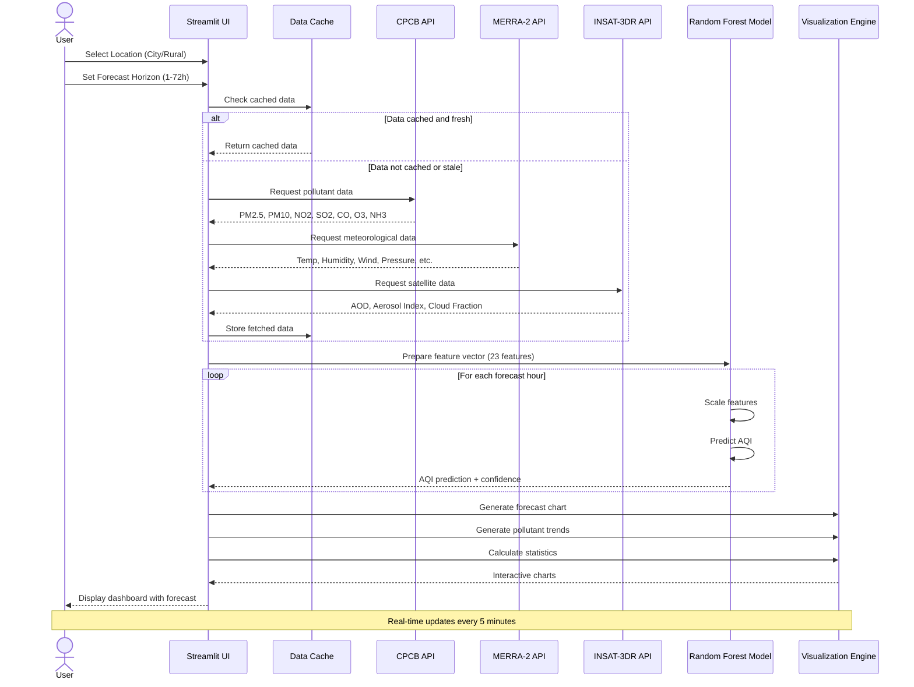
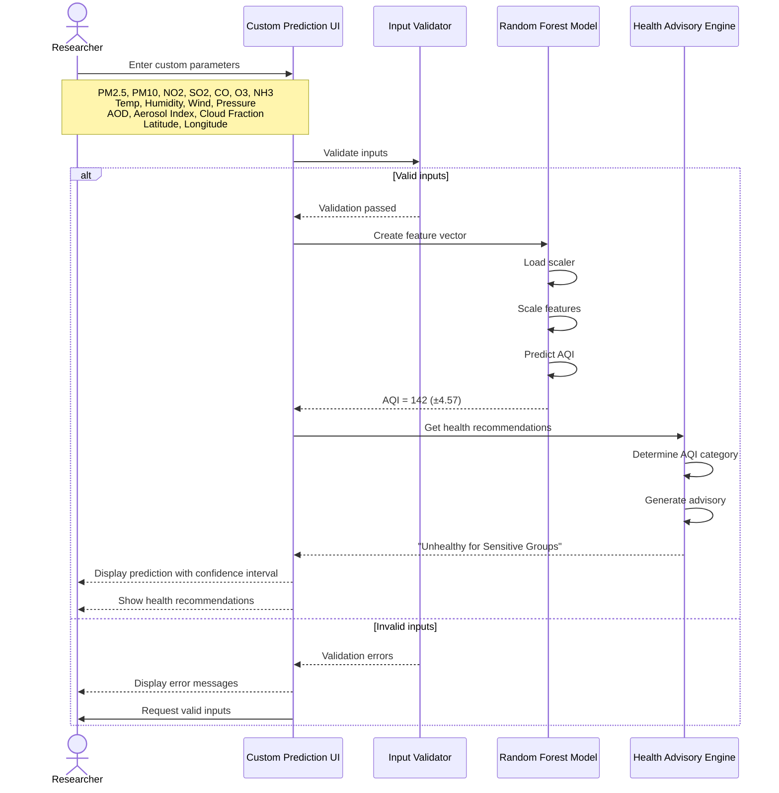
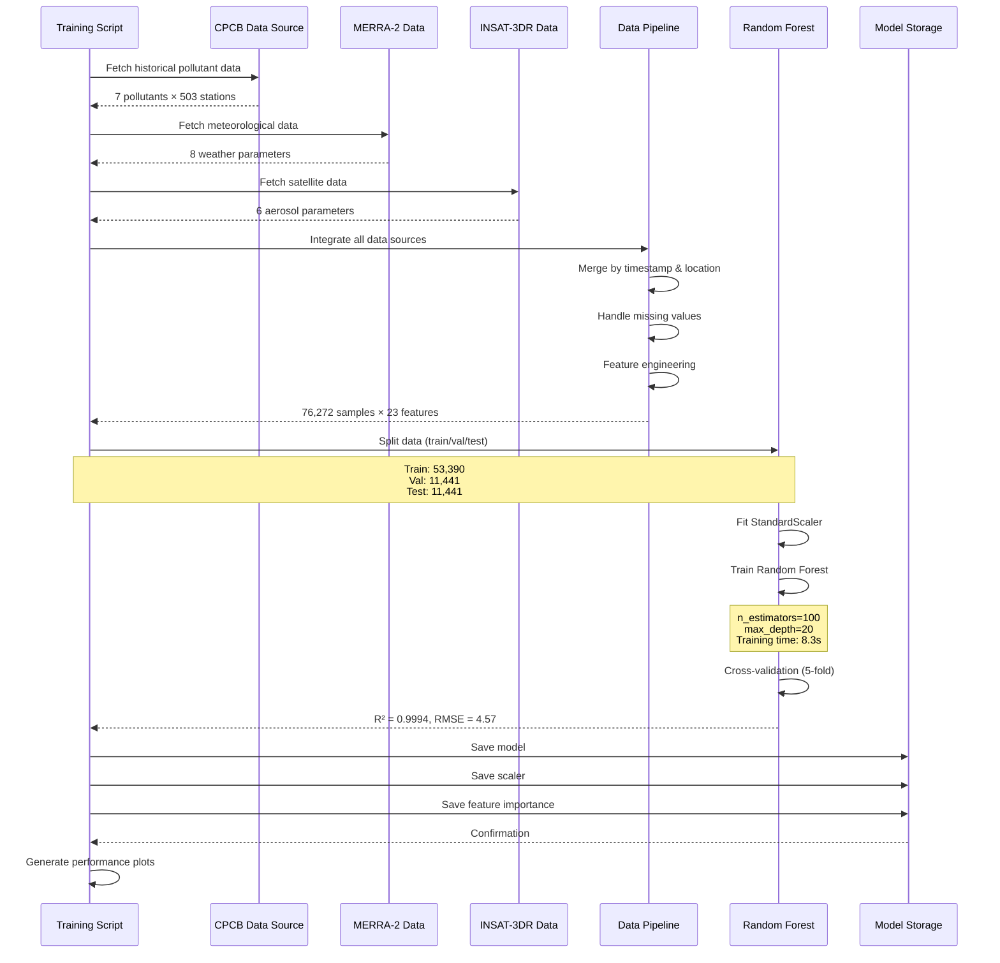
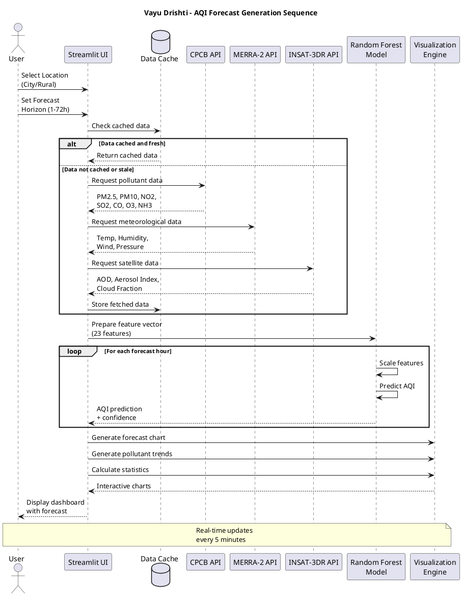

# Sequence Diagram - Vayu Drishti Air Quality Visualizer

## Main Flow: AQI Forecast Generation

### Mermaid Diagram

## Custom Prediction Flow

## Data Integration and Model Training Flow

## PlantUML Code

## Interaction Patterns

### Pattern 1: Real-Time Data Fetching
- **Caching Strategy**: Data cached for 5 minutes to reduce API calls
- **Parallel Requests**: All three data sources (CPCB, MERRA-2, INSAT-3DR) fetched simultaneously
- **Error Handling**: Fallback to cached data if API fails

### Pattern 2: ML Prediction Pipeline
- **Feature Preparation**: 23 features from 3 data sources
- **Scaling**: StandardScaler applied before prediction
- **Confidence Intervals**: ±4.57 AQI (RMSE) for 95% confidence

### Pattern 3: User Interaction
- **Reactive Updates**: Location or forecast horizon changes trigger new predictions
- **Progressive Loading**: Show cached data immediately, update with fresh data
- **Error Recovery**: Graceful degradation if external services unavailable
