# Use Case Diagram - Vayu Drishti Air Quality Visualizer

## Mermaid Diagram

```mermaid
graph TB
    subgraph "Vayu Drishti Air Quality System"
        UC1[View Real-Time AQI]
        UC2[Select Location]
        UC3[View Forecast]
        UC4[View Interactive Map]
        UC5[Get Health Recommendations]
        UC6[View Pollutant Details]
        UC7[Generate Custom Predictions]
        UC8[View Feature Importance]
        UC9[View Model Performance]
        UC10[Compare Urban vs Rural]
        UC11[Export Data]
        UC12[Configure Settings]
    end
    
    subgraph Actors
        User[👤 User/Citizen]
        Researcher[👨‍🔬 Researcher]
        HealthWorker[⚕️ Health Worker]
        PolicyMaker[👔 Policy Maker]
    end
    
    subgraph "External Systems"
        CPCB[(CPCB API)]
        MERRA2[(MERRA-2 API)]
        INSAT[(INSAT-3DR API)]
        ML[🤖 ML Model]
    end
    
    User --> UC1
    User --> UC2
    User --> UC3
    User --> UC4
    User --> UC5
    User --> UC12
    
    Researcher --> UC6
    Researcher --> UC7
    Researcher --> UC8
    Researcher --> UC9
    
    HealthWorker --> UC1
    HealthWorker --> UC5
    HealthWorker --> UC10
    
    PolicyMaker --> UC10
    PolicyMaker --> UC11
    PolicyMaker --> UC9
    
    UC1 -.->|includes| UC2
    UC3 -.->|includes| UC1
    UC3 -.->|uses| ML
    UC4 -.->|includes| UC1
    UC5 -.->|extends| UC1
    UC7 -.->|uses| ML
    
    UC1 -->|fetches data| CPCB
    UC1 -->|fetches data| MERRA2
    UC1 -->|fetches data| INSAT
    UC7 -->|uses| ML
    
    style UC1 fill:#667eea
    style UC3 fill:#667eea
    style UC7 fill:#667eea
    style ML fill:#764ba2
```

## PlantUML Code

## Use Case Descriptions

### UC1: View Real-Time AQI
**Actor:** User, Health Worker  
**Description:** Display current AQI value with color-coded health category  
**Preconditions:** Location selected  
**Postconditions:** AQI displayed with category (Good/Moderate/Unhealthy/etc.)

### UC2: Select Location
**Actor:** User  
**Description:** Choose from 40 locations (10 major cities + 30 rural areas)  
**Preconditions:** Application loaded  
**Postconditions:** Location set, data fetched

### UC3: View Forecast
**Actor:** User, Researcher  
**Description:** View 1-72 hour AQI predictions using ML model  
**Preconditions:** Location selected, model loaded  
**Postconditions:** Forecast chart displayed with confidence intervals

### UC7: Generate Custom Predictions
**Actor:** Researcher  
**Description:** Input custom parameters for AQI prediction  
**Preconditions:** ML model loaded  
**Postconditions:** Custom AQI prediction generated

### UC10: Compare Urban vs Rural
**Actor:** Health Worker, Policy Maker  
**Description:** Compare AQI patterns between urban and rural areas  
**Preconditions:** Data available for both location types  
**Postconditions:** Comparative analysis displayed
